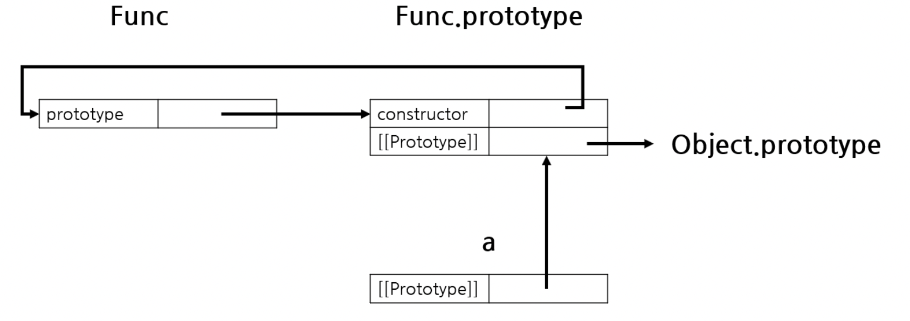

<br />
<br />

# 9. 타입변환

자바스크립트의 모든 값에는 타입이 있으며, 해당 타입은 개발자에 의해 의도적으로 변경되거나, 엔진에 의해 암묵적으로 변경될 수 있습니다.

이 중 개발자에 의해 의도적으로 변경되는 경우를 **명시적 타입 변환**(타입캐스팅)이라고 하며  
엔진에 의해 암묵적으로 타입이 변환되는 경우를 **암묵적 타입 변환**(타입 강제 변환)이라고 합니다.

```js
var x = 10;

// 암묵적 타입 변환
var str = x + "";
console.log(typeof str, str); // string 10

// 명시적 타입 변환
var str = String(x);

console.log(typeof str, str); // string 10
```

위 처럼 함수나 연산자에 전달되는 값은 대부분 적절한 자료형으로 자동 변환됩니다. 이런 과정을 **형 변환**이라고 합니다.

<br />
<br />

## 문자열 타입으로 변환

문자형으로의 형 변환은 문자형의 값이 필요할 때 이루어집니다.

```js
let value = true;
alert(typeof value); // boolean

value = String(value); // 변수 value엔 문자열 "true"가 저장됩니다.
alert(typeof value); // string
```

`false`는 문자열 `"false"`로, `null`은 `"null"`로 변환되는 등, 문자열 타입으로 변환은 예측 가능한 방식으로 일어납니다.

<br />
<br />

## 숫자 타입으로 변환

숫자형으로의 변환은 수학과 관련된 함수와 표현식에서 자동으로 일어납니다.

예를 들면 아래와 같은 코드입니다.

```js
const str1 = "6";
const str2 = "2";
// 암묵적 타입 변환
const num1 = str1 / str2;
// 명시적 타입 변환
const num2 = Number(str1) / Number(str2);
console.log(typeof num1, num1); // number 3
console.log(typeof num2, num2); // number 3
```

하지만 **숫자 이외의 글자가 들어가 있는 문자열**을 숫자 타입으로 변환하려고 하면 그 결과는 `NaN`이 됩니다.

```js
const age = Number("내 나이는 26살");
console.log(age); // NaN
```

아래는 숫자형으로 변환 시 적용되는 규칙입니다.

| 전달 받은 값 |                                                     형 변환 후                                                      |
| ------------ | :-----------------------------------------------------------------------------------------------------------------: |
| `undefined`  |                                                         NaN                                                         |
| `null`       |                                                          0                                                          |
| `true,false` |                                                        1, 0                                                         |
| String       | 문자열의 처음, 끝 공백 제거 후 남아있는 문자열이 없다면 `0`, <br> 그렇지 않다면 문자열에서 숫자를 읽은 후 `NaN`판별 |

```js
console.log(Number("     123  ")); // 123
console.log(Number(" 133a")); // NaN
console.log(Number(undefined)); // NaN
console.log(+null); // 0
console.log(Number(true)); // 1
console.log(Number(false)); // 0
```

여기서 유의해야할 점은 `null`과 `undefined`는 숫자형으로 변환 시 결과가 다르다는 점입니다.

<br />
<br />

## 불리언 타입으로 변환

불리언으로의 형 변환은 논리 연산을 수행할 때 발생합니다.

불린형으로 변환 시 적용되는 규칙은 아래와 같습니다.

- 숫자 `0`, `""`(빈 문자열), `null`,`,undefuned`,`NaN`과 같이 직관적으로 **비어있다**라고 느껴지는 값들은 `false`로 형 변환이 됩니다.
- 그 외의 값은 `true`로 변환됩니다.

```js
console.log(Boolean(1)); // true
console.log(Boolean(0)); // false
console.log(!!"티맥스"); // true
console.log(Boolean("0")); // true
console.log(Boolean("")); // false
```

<br />
<br />

## 단축 평가

**논리곱**(`&&`) 또는 **논리합**(`||`)연산자 표현식은 언제나 2개의 피 연산자 중, 어느 한쪽으로 평가됩니다. 논리 연산의 결과를 평가하는 도중에 평가 결과가 확정된 경우 그 값을 그대로 반환하고 나머지 평가 과정을 생략하는 것을 **단축 평가**라고 부릅니다.

```js
"Cat" && "Dog"; // "Dog"
```

1. "Cat" true
2. "Dog" true
3. "Dog" 리턴

<br />

```js
"Cat" || "Dog"; // "Cat"
```

1. "Cat" true
2. "Cat" 리턴

<br />

```js
true || anything; // true
false || anything; // anything
true && anything; // anything
false &&
  anything // false
  ``;
```

<br />
<br />

- 어떤 조건이 Truthy값일 때 무언가를 해야한다면 논리곱 연산자 표현식으로 if문을 대체할 수 있습니다.

```js
return (
  <>
    <SideTabBlock>
      {Object.values(TabType).map((tabType) => (
        <Surface
          key={tabType}
          tabType={tabType}
          onClick={onClick}
          selected={selectedTab === TabLabel[tabType]}
        />
      ))}
    </SideTabBlock>
    {selectedTab === TabLabel[TabType.TUPOL] && <TupolTabView />}
    {selectedTab === TabLabel[TabType.MONITOR] && <MonitorTabView />}
    {selectedTab === TabLabel[TabType.USER] && <UserTabView />}
  </>
);
```

- 객체가 null인지 확인하고 프로퍼티를 참조할 때

```js
var elem = null;

console.log(elem.value); // TypeError: Cannot read property 'value' of null
console.log(elem && elem.value); // null
console.log(elem?.value); // undefined
```

<br />
<br />

# 10. 객체란

자바스크립트는 데이터 저장을 위해 7가지의 원시자료형과 객체, 2가지 종류의 자료형을 사용합니다. 원시형은 오직 하나의 데이터만을 담을 수 있어 원시형이라 부릅니다.

하지만 객체형은 원시형과 달리 다양한 데이터를 담을 수 있습니다. Key와 Value로 구성된 Property를 여러개 넣을 수 있는데 Key에는 문자열, Value에는 모든 자료형이 허용됩니다.
그리고 특별히 Property의 값이 함수일 경우에는 메소드라고 부르기도 합니다.

<br/>
<br/>

## 객체의 생성

자바스크립트에서 다양한 객체 생성 방법을 가지고 있습니다.

- 객체 리터럴
- Object 객체 생성자
- 생성자 함수
- Object.create 메서드
- 클래스(ES6)

이 중 가장 일반적이고 간단한 방법은 객체리터럴을 사용하는 것입니다.

```js
const user1 = new Object(); // 객체 생성자 문법
user1.name = "서우석";
user1.age = 26;

const user2 = {
  name: "서우석",
  age: 26,
}; // 객체 리터럴 문법

function User(name, age) {
  this.name = name;
  this.age = age;
  this.sayHello = function () {
    console.log(`안녕! 나는 ${name}!`);
  };
}

const user3 = new User("서우석", 26); // 생성자 함수
```

## 객체 프로퍼티 접근

객체의 프로퍼티 값에 접근하는 방법은 두가지 입니다.

- 마침표 프로퍼티 접근 연산자.를 사용하는 마침표 표기법
- 대괄호 프로퍼티 접근 연산자[]를 사용하는 대괄호 표기법

```js
var person = {
  "first-name": "우석",
  "last-name": "서",
  age: 26,
};
console.log(person.age); // 26
console.log(person["first-name"]); // '우석'
```

### 프로퍼티 갱신

이미 존재하는 프로퍼티에 값을 할당하면 프로퍼티 값이 갱신됩니다.

```js
var person = {
  name: "우석",
};
person.name = "서우석";
```

### 프로퍼티 동적 생성

존재하지 않는 프로퍼티에 값을 할당하면 프로퍼티가 동적으로 생성되어 추가되고 프로퍼티 값이 할당됩니다.

```js
var person = {
  name: "우석",
};
person.age = 26;
```

### 프로퍼티 동적 생성

`delete`연산자는 객체의 프로퍼티를 삭제합니다. 이때 `delete`연산자의 피연산자는 프로퍼티 값에 접근할 수 있는 표현식이어야 합니다. 만약 존재하지 않는 프로퍼티를 삭제하면 아무런 에러 없이 무시됩니다.

```js
var person = {
  name: "우석",
};
person.age = 26;

delete person.age;

delete person.adderss; // 무시됨 에러 발생 X
```

### property shorthand

ES6에서는 property shorthand(단축 속성명)을 제공합니다.
property shorthand는 객체를 정의 할 때 객체의 key값과 value의 값이 같으면, key 와 value 값을 각각 표기하지 않고 한 번만 표기하는 것을 의미합니다.

```js
const a = "foo";
const b = 42;
const c = {};
//아래와 같이 작성할 수도 있지만
const object = {
  a: a,
  b: b,
  c: c,
};
// ES6의 property shorthand를 이용하여 간견하게 표기할 수 있다.
const object = {
  a,
  b,
  c,
};
```

<br />
<br />

# 11. 객체의 변경불가성

객체는 프로퍼티의 개수가 정해져 있지 않으며, 동적으로 추가되고 삭제될 수 있습니다. 또한 프로퍼티의 값에도 제약이 없습니다. 따라서 객체는 원시 값과 같이 확보해야할 메모리 공간의 크기를 사전에 정할 수가 없는데요. 원시 값은 상대적으로 적은 메모리를 소비하지만 객체는 경우에 따라 크기가 매우 클 수도 있습니다. 그래서 객체를 생성하고 프로퍼티에 접근하는 것도 원시 값과 비교할 때 비용이 많이 드는 일입니다. 그래서 객체는 원시 값과 다른 방식으로 동작합니다

객체(참조) 타입은 원시값과 다르게 변경 가능한 값(mutable value) 입니다.
먼저 변수에 객체를 할당하면 어떤 일이 발생할까요?

```js
var user = {
  name: "우석",
};
```

위와 같이 선언했을 때 객체를 할당한 변수는 동적으로 변할 수 있는 메모리 공간에 있는 데이터의 주소를 가리키는 참조값을 갖습니다. 여기서 참조 값은 생성된 객체가 저장된 메모리 공간의 주소, 그 자체입니다. 그래서 객체를 할당한 변수를 참조하면 메모리에 저장되어 있는 참조 값을 통해 실제 객체에 접근합니다.

```js
var user = {
  name: "석석석",
};

//참조값을 복사하게됨, 얕은 복사
var copy = user;

console.log(copy === user); // true

copy.name = "우석";
user.address = "Seoul";

console.log(user); // {name: "우석", address: "Seoul"}
console.log(copy); // {name: "우석", address: "Seoul"}
```

객체를 가리키는 변수(원본, user)를 다른 변수(사본, copy)에 할당하면 원본의 참조 값이 복사되어 전달됩니다. 이를 참조에 의한 전달이라고 합니다.

원본 user을 사본 copy에 할당하면 원본 user의 참조 값을 복사해서 copy에 저장합니다. 이 때 원본 user과 사본 copy는 저장된 메모리 주소는 다르지만 동일한 참조 값을 갖습니다. 따라서 원본 또는 사본 중 어느 한쪽에서 객체를 변경(변수에 새로운 객체를 재할당하는 것이 아니라 객체의 프로퍼티 값을 변경하거나 프로퍼티를 추가, 삭제)하면 서로 영향을 주고받습니다.

<br/>

## 불변 데이터 패턴

의도하지 않은 객체의 변경이 발생하는 원인의 대다수는 “레퍼런스를 참조한 다른 객체에서 객체를 변경”하기 때문입니다. 이 문제의 해결 방법은 비용은 조금 들지만 객체를 불변객체로 만들어 프로퍼티의 변경을 방지하거나 객체의 변경이 필요한 경우에는 참조가 아닌 객체의 방어적 복사(defensive copy)를 통해 새로운 객체를 생성한 후 변경하는 방식입니다.

이를 위해서는 여러가지 방법이 있습니다.

- 객체의 방어적 복사(defensive copy)
  - Object.assign
- 불변객체화를 통한 객체 변경 방지
  - Object.freeze
- 라이브러리 사용

  - Immutable.js, immer

  <br/>
  <br/>

## Object.assign

Object.assign은 target 객체로 sources객체들의 프로퍼티를 복사하여 반환해줍니다.

```js
Object.assign(target, ...sources);

// Copy
const obj = { a: 1 };
const copy = Object.assign({}, obj);
console.log(copy); // { a: 1 }
console.log(obj == copy); // false

// Merge
const o1 = { a: 1 };
const o2 = { b: 2 };
const o3 = { c: 3 };

const merge1 = Object.assign(o1, o2, o3);

console.log(merge1); // { a: 1, b: 2, c: 3 }
console.log(o1); // { a: 1, b: 2, c: 3 }, 타겟 객체가 변경된다!

const user1 = {
  name: "우석",
  address: {
    city: "Seoul",
  },
};

// 새로운 빈 객체에 user1을 copy한다.
const user2 = Object.assign({}, user1);
console.log(user1.address === user2.address); // true
```

  <br/>

## Object.freeze

Object.freeze()를 사용하여 불변(immutable) 객체로 만들수 있다.

```js
const user1 = {
  name: "Lee",
  address: {
    city: "Seoul",
  },
};
Object.freeze(user1);
user1.name = "Kim"; // 무시된다!
user1.address.city = "Busan"; // 변경됨
console.log(user1); //{ name: 'Lee', address: { city: 'Busan' } }
```

## 라이브러리

- Immutable.js
- immer
- lodash

<br/>
<br/>

# 12. 함수

함수란 어떤 작업을 수행하기 위해 필요한 문(statement)들의 집합을 정의한 코드 블록입니다. 함수는 입력을 받아서 출력을 내보내는데, 함수 내부로 입력을 전달받는 변수를 **매개변수(parameter)** 입력을 **인수(argument)**, 출력을 **반환값(return value)**이라고 합니다.

<br />

## 함수 정의

**함수 정의**란 함수를 호출하기 이전에 인수를 전달받을 매개변수와 실행문들 그리고 반환할 값을 지정하는 것을 말합니다.

함수을 정의하는 방식은 3가지가 있습니다.

- 함수 선언문
- 함수 표현식
- Function 생성자 함수

<br/>

## 함수 선언문

함수 선언문은 function 키워드와 함수명, 매개변수, 함수 몸체로 이루어져 있습니다.

```js
// 함수 선언문
function add(x, y) {
  return x + y;
}
```

<br/>

## 함수 표현식

자바스크립트의 함수는 값처럼 변수에 할당할 수도 있고, 프로퍼티 값이 될 수도 있으며 배열의 요소가 될 수도 있습니다. 이처럼 값이 성질을 갖는 객체를 일급객체라 하며

자바스크립트의 함수는 **일급 객체**이므로 아래와 같은 특징이 있습니다.

1. 무명의 리터럴로 표현이 가능
2. 변수나 자료구조에 저장 가능
3. 함수의 파라미터로 전달 가능
4. 반환값으로 사용 가능

```js
// 1. 무명의 리터럴로 표현이 가능
// 2. 변수나 자료구조에 저장 가능
const add = function (x, y) {
  return x + y;
};
// 3. 함수의 파라미터로 전달 가능
// 4. 반환값으로 사용 가능
const foo = (callback, x, y) => {
  return callback(x, y);
};

console.log(foo(add, 1, 2)); // 3
```

따라서 함수 리터럴로 생성한 함수 객체를 변수에 할당할 수 있으며 이러한 함수 정의를 **함수 표현식**이라고 합니다. 함수 선언문으로 정의한 add함수를 표현식으로 바꾸면 아래와 같습니다.

```js
// 함수 표현식
const add = function (x, y) {
  return x + y;
};
```

함수 리터럴의 함수 이름은 생략할 수 있습니다. 이러한 함수를 **익명 함수**라고 하며 보통의 표현식에서는 익명함수를 많이 사용합니다.

<br/>

## Function 생성자 함수

함수 표현식으로 함수를 정의할 때 함수 리터럴 방식을 사용하는데, 함수 선언문도 자바스크립트 엔진 내부적으로 함수 리터럴 방식을 사용합니다.

따라서 위의 선언문과 표현식은 전부 Function 생성자 함수로 생성하는 것을 단순화 시킨 축약법입니다.

```js
// Function 생성자 함수
const add = new Function("x", "y", "return x + y");

console.log(add(1, 2)); //3
```

하지만 우리가 사용할 일은 없다...

<br/>
<br/>

## 함수 생성 시점과 함수 호이스팅

함수 선언문으로 정의한 함수는 함수 선언문 이전에 호출할 수 있습니다. 하지만 함수 표현식으로 정의한 함수는 함수 표현식 이전에 호출할 수 없습니다. 이는 함수 선언문으로 정의한 함수와 함수 표현식으로 정의한 함수의 생성시점이 다르기 때문입니다.

```js
console.log(add(1, 2)); // 3
console.sub(sub(1, 2)); // TypeError: sub is not a function

// 함수 선언문
function add(x, y) {
  return x + y;
}
// 함수 표현식
const sub = function (x, y) {
  return x - y;
};
```

자바스크립트의 가장 큰 특징은 모든 선언문들이 스코스의 최상단으로 옮겨진 것 처럼 동작하는 것입니다.
선언문 또한 예외는 아니라 위처럼 호이스팅이 되어 add함수를 사용할 수 있습니다.

하지만 함수 표현식은 함수가 호이스팅되는 것이 아닌 변수가 호이스팅 되므로 undefined로 초기화된 상태로 함수를 호출하는 것과 마찬가지이므로 타입에러가 발생합니다.

<br/>

## 화살표 함수

ES6에서 도입된 화살표 함수는 function키워드 대신 화살표를 사용해 좀 더 간략하게 함수를 선언할 수 있습니다.

```js
const add = (x, y) => x + y;
```

<br/>
<br/>

## 매개변수와 인수

함수를 실행하기 위해 필요한 값을 함수 외부에서 함수 내부로 전달할 필요가 있는 경우, 매개변수를 통해 인수를 전달합니다. 인수는 값으로 평가될 수 있는 표현식이어야 합니다. 인수는 함수를 호출할 때 지정하며, 개수와 타입에 제한이 없습니다.

```js
function add(x, y) {
  return x + y;
}

const result = add(1, 2);
```

매개변수는 함수를 정의할 때 선언하며, 함수 몸체 내부에서 변수와 동일하게 취급됩니다. 함수가 호출되면 함수 몸체 내에서 암묵적으로 매개변수가 생성되고 일반 변수와 마찬가지로 undefined로 초기화된 이후 인수가 순서대로 할당됩니다.

함수는 매개변수의 개수와 인수의 개수가 일치하는지 체크하지 않습니다. 인수가 부족해서 인수가 할당되지 않은 매개변수의 값은 undefined입니다.

```js
function add(x, y) {
  return x + y;
}

console.log(add(2)); // NaN
```

<br/>

## 매개변수 전달

매개변수는 함수 몸체 내부에서 변수와 동일하게 취급되므로 타입에 따라 값에 의한 전달, 참조에 의한 전달 방식으로 동작합니다.

```js
// 매개변수 primitive는 원시 값을 전달받고, 매개변수 obj는 객체를 전달받음
function changeVal(primitive, obj) {
  primitive += 100;
  obj.name = "Kim";
}

var num = 100;
var person = { name: "Lee" };

console.log(num); // 100
console.log(person); // {name: 'Lee'}

// 원시 값은 값 자체가 복사되어 전달되고 객체는 참조 값이 복사되어 전달
changeVal(num, person);

console.log(num); // 100

console.log(person); // {name: "Kim"}
```

<br/>
<br/>

## 함수의 객체 프로퍼티

함수도 객체이므로 프로퍼티를 가질 수 있습니다.

- arguments 프로퍼티
  - 함수 호출 시 전달된 인수들의 정보를 담고있는 객체
- caller 프로퍼티
  - 자신을 호출한 함수를 의미
- length 프로퍼티
  - 매개변수의 갯수를 의미
- name 프로퍼티
  - 함수명을 의미
- **proto** 접근자 프로퍼티

<br/>

## 다양한 함수 형태

### 즉시 실행 함수

함수 정의와 동시에 즉시 호출되는 함수를 **즉시 실행 함수**라고 합니다. 즉시 실행 함수는 단 한번만 호출되며 다시 호출할 수 없습니다.

```js
(function () {
  const a = 3;
  const b = 5;
  return a * b;
})();
```

즉시 실행 함수는 함수 이름이 없는 익명함수를 사용하는 것이 일반적입니다.
기명함수는 함수 선언문이 아니라 함수 리터럴로 평가되며 함수 이름은 함수 몸체에서만 참조할 수 있는 식별자이므로 즉시 실행함수를 다시 호출할 수는 없습니다.

```js
(function foo() {
  const a = 3;
  const b = 5;
  return a * b;
})();

foo(); // ReferenceError: foo is not defined
```

<br/>

### 내부 함수

함수 내부에 정의된 함수를 내부함수라 합니다.

```js
function parent(paran) {
  const parent = param;
  function child() {
    const name = "Woo";
    console.log(parent + " " + name); // Hello Woo
  }
  child();
  console.log(parent + " " + name); // name is not defined
}
```

<br/>

### 재귀함수

함수가 자기 자신을 호출하는 것을 재귀 호출이라고 합니다. 재귀함수는 자기 자신을 호출하는 행위를 말하고, 반복되는 처리를 위해 사용합니다.

```js
function countdown(num) {
  if (num < 0) return;
  console.log(num);
  countdown(num - 1);
}
countdown(10); // 10 9 8 ...
```

<br/>

### 콜백 함수

콜백 함수는 함수를 명시적으로 호출하는 방식이 아니라 특정 이벤트가 발생했을 때 시스템에 의해 호출되는 함수를 말합니다.

```js
function repeat(n) {
  for (let i = 0; i < n; i++) {
    console.log(i);
  }
}
repeat(5); // 0 1 2 ...
```

위의 repeat함수는 매개변수를 통해 전달받은 숫자만큼 반복하며 log를 호출합니다. 이때 repeat함수는 console.log에 강하게 의존하고 있어 다른 일을 할 수 없습니다. 만약 repeat함수의 반복문 내부에서 다른 일을 하고 싶다면 함수를 새롭게 정의해야합니다.

```js
function repeat(n) {
  for (let i = 0; i < n; i++) {
    console.log(i);
  }
}

function repeatOdds(n) {
  for (let i = 0; i < n; i++) {
    if (i % 2) console.log(i);
  }
}
repeat(5); // 0 1 2 ...
repeatOdds(5); // 1 3
```

위의 함수들은 반복하는 일을 공통적으로 수행하지만 그 내용은 다릅니다. 때문에 함수를 새롭게 정의해야하는 까다로움이 있습니다. 이러한 문제를 함수를 합성함으로써 해결할 수 있습니다. 변하지 않는 공통로직을 추상화하여 함수 외부에서 내부로 전달하는 방식입니다.

```js
function newRepeat(n, callback) {
  for (let i = 0; i < n; i++) {
    callback(i);
  }
}

const logAll = (i) => console.log(i);
const logOdds = (i) => i % 2 && console.log(i);

newRepeat(5, logAll); // 0 1 2 ...
newRepeat(5, logOdds); // 1 3
```

`newRepeat`함수는 경우에 따라 변경되는 일을 함수 callback으로 추상화 했고 이를 외부에서 전달받습니다.

함수의 매개변수를 통해 다른 함수의 내부로 전달되는 함수를 **콜백 함수**라고 하며, 매개변수를 통해 함수의 외부에서 콜백함수를 전달받은 함수를 **고차 함수**라고 합니다.

또한 콜백함수는 비동기 처리에 활용되는 중요한 패턴입니다.

```js
qs(".myButton").addEventListener("click", function () {
  console.log("버튼 클릭");
});

setTimeout(function () {
  console.log("1초 뒤 실행");
}, 1000);
```

<br/>

# 13 타입체크

자바스크립트는 동적 타입 언어이므로 변수에 어떤 값이 할당될지 예측하기 어렵습니다.

```js
function add(x, y) {
  return x + y;
}
console.log(add(2)); // NaN
console.log(add("a", "b")); // "ab"
```

자바스크립트의 함수는 매개변수와 인수의 갯수가 일치하는지 확인하지 않으며 매개변수의 타입을 사전에 지정할 수 없습니다. 따라서 함수를 정의할 때 적절한 인수가 전달되었는지 확인할 필요가 있습니다.

```js
function add(x, y) {
  if (typeof x !== "number" || typeof y !== "number") {
    throw new Error("인수는 모두 숫자 값이어야 합니다.");
  }
  return x + y;
}
console.log(add(2)); // Error: 인수는 모두 숫자 값이어야 합니다.
console.log(add("a", "b")); // Error: 인수는 모두 숫자 값이어야 합니다.
```

ES6 이후에 나온 매개면수 기본값을 사용하면 함수 내에서 수행하던 인수 체크 및 초기화를 간소화 할 수 있습니다.

```js
function add(x = 0, y = 0) {
  if (typeof x !== "number" || typeof y !== "number") {
    throw new Error("인수는 모두 숫자 값이어야 합니다.");
  }
  return x + y;
}
console.log(add(2)); // 2
console.log(add("a", "b")); // Error: 인수는 모두 숫자 값이어야 합니다.
```

# 14 프로토타입

자바스크립트는 프로토타입 기반 언어입니다. 클래스 기반 언어에서는 "상속"을 사용하지만 프로토타입 기반 언어에서는 어떤 객체를 원형으로 삼고 이를 복제(참조)함으로써 상속과 비슷한 효과를 얻습니다.

자바스크립트의 모든 객체는 자신의 **원형(Prototype)**이 되는 객체를 가지며 이를 프로토타입이라고 합니다.

자바스크립트는 함수에 자동으로 객체인 prototype 프로퍼티를 생성해 놓습니다. 그래서 해당 함수를 생성자 함수로써 사용할 경우, 즉 new 연산자와 함께 함수를 호출할 경우, 그로부터 생성된 인스턴스에는 숨겨진 프로퍼티인 `__proto__`가 자동으로 생성됩니다. 그리고 이 프로퍼티는 생성자 함수의 prototype을 참조합니다.

## .prototype과 [[Prototype]]

모든 객체는 은닉속성인 [[Prototype]]을 갖습니다. 그리고 특별히 **함수 객체**는 접근할 수 있는 속성인 prototype을 갖습니다.

- `[[Prototype]]`: 자신의 프로토타입 객체를 참조하는 속성
- `.prototype` : new 연산자로 자신을 생성자 함수로 사용한 경우, 그걸로 만들어진 새로운 객체의 `[[Prototype]]`을 참조하는 값

```js
function Func() {}
const a = new Func();
```

위 코드를 보면 Func를 생성자로 호출하여 새로운 객체 a를 생성합니다. 이는 아래와 같은 구조로 프로토타입이 연결됩니다.


위 그림대로 new 연산자로 Func를 호출하면 a가 만들어지고, 이 a가 가지고있는 프로퍼티인 `__proto__`는 Func의 prototype을 참조합니다.

`constructor`는 모든 `.prototype`객체의 속성에 있는 것으로 실제 객체를 참조합니다.
따라서 위와 같이 `Func`을 가리키는 것이고, Func.prototype의 `[[Prototype]]`이 `Object.prototype`으로 연결되어있는데 이는 모든 객체의 프로토타입객체의 마지막으로 연결되는 프로토타입 객체입니다. 정리하자면

- `new`연산자로 새로운 객체 a를 생성하면, a의 프로토타입 객체는 생성자 함수로 사용한 Func의 속성인 Func.prototype이 된다.
- Func.prototype은 constructor속성을 가지며 이는 실제 객체 Func를 가리킨다.
- Func.prototype 또한 객체이므로 `[[Prototype]]`을 가지고 있는 모든 객체의 원형이 되는 객체인 `Object.prototype`을 가리킵니다.

<br/>

## Prototype chain

어떤 객체의 프로퍼티를 참조하거나 값을 할당할 때 **해당 객체에 프로퍼티가 없을 경우, 그 객체의 프로토타입 객체를 연쇄적으로 보면서 프로퍼티를 찾는 방식**을 프로토타입 체인이라고 합니다.

- 프로퍼티를 참조할 때
  - 찾고자 하는 프로퍼티가 객체에 존재하면 사용한다.
  - 없으면 `[[Prototype]]`링크를 타고 올라가면서 프로퍼티를 찾는다.
  - 찾으면 그 값을 사용하고, 없으면 `undefined`를 반환한다.
- 프로퍼티에 값을 할당할 때
  - 찾고자하는 프로퍼티가 객체에 존재하면 값을 바꾼다.
  - 프로퍼티가 없고 `[[Prototype]]`링크를 타고 올라가서 해당 프로퍼티를 찾았을 경우
    - 그 프로퍼티가 변경가능한 값이라면 새로운 직속 프로퍼티를 할당해서 상위 프로퍼티가 가려지는 현상이 발생한다.
    - 그 프로퍼티가 변경불가능한 값이라면 비엄격모드에서는 무시되고 엄격모드에서는 에러가 발생한다.

여기서 **가려짐**이란, 상위 프로토타입 객체에 동일한 이름의 프로퍼티가 있는경우 하위 객체의 프로퍼티에 의해 가려지는 현상을 말합니다.

```js
function Func() {}
Func.prototype.num = 2;
const a = new Func();
a.num = 1;
console.log(Func.prototype); // { num: 2 }
console.log(a); // Func { num: 1 }
console.log(a.num); // 1
```

위 코드의 경우 객체 a의 프로토타입 객체인 `Func.prototype`에 `num`이 있지만 `a.num = 1`로 인해 가려짐 현상이 발생해서 1을 출력합니다.

```js
function Func() {}
Object.defineProperty(Func.prototype, "num", {
  value: 2,
  writable: false,
});

const a = new Func();
a.num = 1; // 무시됨
console.log(a.num); // 2
```

그러나 `defineProperty`를 사용해서 변경 불가능한 프로퍼티로 만들면 무시됩니다.

<br/>

## Mixin

자바스크립트 객체는 상속받거나 생성자를 통해 생성하더라도 자동으로 복사작업이 일어나지 않습니다. Mixin은 자바스크립트에선 없는 클래스 복사 기능을 흉내낸 것으로 다른 객체에 행동을 더해주는 용도로 사용됩니다.

```js
const clickableMethods = {
  hover() {
    console.log("hovering");
  },
  press() {
     console.log("button pressed");
  }
  click() {
     console.log("button clicked");
  }
};
```

프로토타입을 활용한 믹스인을 이용하여 위의 클릭과 관련된 함수 기능을 그대로 활용하고자 한다면 다음과 같이 사용할 수 있습니다.

```js
function Button(size, color) {
  this.size = size;
  this.color = color;
}
Object.assign(Button.prototype, clickableMethods);

new Button(20, "red").hover(); // hovering
```

<br/>
<br/>

# 15 스코프

스코프는 변수, 함수와 깊은 관련이 있습니다.
함수의 매개변수는 함수 몸체 내에서만 참조할 수 있고, 함수 몸체 외부에서는 참조할 수 없습니다.
매개변수의 스코프가 함수 몸체 내부로 한정되기 때문입니다.

```js
function add(x, y) {
  console.log(x, y);
  return x + y;
}

add(2, 5); // 2 5

console.log(x, y); // ReferenceError: x is not defined
```

변수는 코드의 가장 바깥 영역뿐 아니라 코드 블록이나 함수 몸체 내에서도 선언할 수 있습니다. 이때 코드 블록이나 함수는 중첩될 수 있습니다.

```js
var var1 = 1; // 코드의 가장 바깥 영역에서 선언한 변수

if (true) {
  var var2 = 2; // 코드 블록 내에서 선언한 변수
  if (true) {
    var var3 = 3; // 중첩된 코드 블록 내에서 선언한 변수
  }
}

function foo() {
  var var4 = 4; // 함수 내에서 선언한 변수

  function bar() {
    var var5 = 5; // 중첩된 함수 내에서 선언한 변수
  }
}

console.log(var1); // 1
console.log(var2); // 2
console.log(var3); // 3
console.log(var4); // ReferenceError: var4 is not defined
console.log(var5); // ReferenceError: var5 is not defined
```

모든 식별자(변수 이름, 함수 이름, 클래스 이름 등)는 자신이 선언된 위치에 의해 다른 코드가 식별자 자신을 참조할 수 있는 유효 범위가 결정됩니다. 이를 스코프라고 합니다.

```js
var x = "global";

function foo() {
  var x = "function scope";
  console.log(x);
}

foo(); // function scope
console.log(x); // global
```

<br/>

## 스코프의 종류

코드는 전역과 지역으로 구분할 수 있습니다. 이때 변수는 자신이 선언된 위치에 의해 자신이 유효한 범위인 스코프가 결정됩니다. **전역에서 선언된 변수**는 **전역 스코프**를 갖는 **전역 변수**이고, **지역에서 선언된 변수**는 **지역 스코프**를 갖는 **지역 변수**입니다.

<br/>
<br/>

## 자바스크립트 스코프의 특징

- 함수 레벨 스코프 (var)
- 블록 레벨 스코프 (let, const)

<br/>

## 함수 레벨 스코프

코드 블록이 아닌 함수에 의해서만 지역 스코프가 생성됩니다.
자바스크립트의 `var`로 생성된 변수는 오직 함수의 코드블럭만을 지역 스코프로 인정합니다. 이런 특성을 **함수 레벨 스코프**라고 합니다.

```js
var x = 1;

if (true) {
  var x = 10;
}

console.log(x); // 10
```

전역변수 x가 선언되었고, if문의 코드 블록 내에도 x변수가 선언되었습니다. var변수는 함수 레벨 스코프이기 때문에 if문의 코드 블록 내에서 선언된 x변수는 전역변수입니다.
따라서 의도치 않은 전역 변수의 값이 재할당 되었습니다.

```js
var i = 10;

for (var i = 0; i < 5; i++) {
  console.log(i); // 0 1 2 3 4
}

console.log(i); // 5
```

심지어 for문 코드 블럭 내의 변수 `var i`도 블록 레벨 스코프가 아니기 때문에 전역변수의 값이 계속해서 중복 선언되고 결과적으로 의도치 않은 변수의 값이 재할당됩니다.

<br/>

## 블록 레벨 스코프

블록 레벨 스코프는 함수 몸체 뿐만아니라 모든 코드블록이 지역 스코프를 만듭니다.
ES6에서 추가된 `let`과 `const`를 이용하면 블록레벨 스코프를 사용할 수 있고, 위와같은 의도치않은 결과가 일어나지 않습니다.

```js
let x = 1;

if (true) {
  let x = 10;
}

console.log(x); // 1
```

<br/>

## 렉시컬 스코프

프로그래머가 코드를 짤 때, 변수 및 함수/ 블록 스코프를 어디에 작성하였는가에 따라 정해지는 스코프를 렉시컬 스코프라고 합니다.

```js
var x = 1;

function foo() {
  var x = 10;
  bar();
}

function bar() {
  console.log(x);
}

foo(); // ?
bar(); // ?
```

똑같이 `변수 x`가 전역, 함수 스코프에 선언되었고, `console.log`는 `bar`함수 안에 선언되어져 있습니다. 위 예제의 실행 결과는 `bar`함수의 상위 스코프가 무엇인지에 따라 결정됩니다.

​
자바스크립트는 렉시컬스코프를 따르므로 `bar`함수의 호출 위치에 상관없이 선언한 위치에 따라 상위 스코프가 결정되므로 `bar`함수의 상위 스코프는 전역(Global)입니다.

<br/>

## 스코프 체인(Scope Chain)

현재 스코프에서 식별자를 검색할 때 상위 스코프에서 연쇄적으로 찾아나가는 방식을 말합니다. 실행 컨텍스트가 생성되면 Lexical환경이 만들어지고 그 안에 outer참조 값이 있다는 것을 알 것입니다. 바로 이 참조값이 상위 Lexical환경을 가리키기 때문에 이를 통해 체인처럼 연결 할 수 있습니다.

```js
GlobalExecutionObject = {
    LexicalEnvironment : {
        EnvironmentRecord: {
            a: 2,
            b: 3,
            foo: <func>
        },
        outer : < GlobalLexicalEnvironment >
        ThisBinding: <Global Object>
    },
    VariableEnvironment : {
        EnvironmentRecord: {
            c: undefined
        },
        outer : < GlobalLexicalEnvironment >
        ThisBinding: <Global Object>
    }
}

```

즉 스코프 체인을 아래와 같은 과정을 거쳐 식별자를 검색합니다.

1. 현재 실행 컨텍스트의 LexicalEnvironment의 EnvironmentRecord에서 식별자를 검색한다.

2. 없으면 outer 참조 값으로 스코프 체인을 타고 올라가 상위 스코프의 EnvironmentRecord에서 식별자를 검색한다.

3. 이를 outer 참조 값이 Null 일 때까지 계속하고 찾지 못한다면 에러를 발생시킨다.
