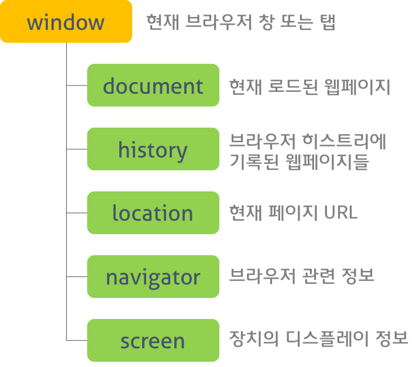
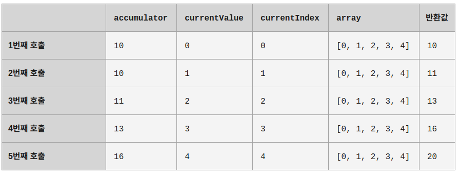

# 21 빌트인 객체

자바스크립트의 객체는 크게 3가지로 분류할 수 있습니다.

- 네이티브 객체(표준 빌드인 객체)
  - ECMAScript명세에 정의된 객체를 말하며 애플리케이션 전역의 공통 기능을 제공
- 호스트 객체
  - 실행 환경에서 추가적으로 제공하는 객체
- 사용자가 정의한 객체

<br/>

## 네이티브 객체(표준 빌드인 객체)

Object, String, Number, Boolean, Date, Promise ...

string, number, boolean등의 원시타입이 이미 있는데, 객체를 생성하는 빌트인 생성자가 왜 존재할까???

<br/>

## 래퍼 객체

자바스크립트는 원시값(문자열, 숫자 등)을 마치 객체처럼 다룰 수 있게 해줍니다

```js
const str = "Hello world!";
const res = str.toUpperCase();
// const res = new String(str).toUpperCase();
console.log(res); // 'HELLO WORLD!'

const num = 1.5;
console.log(num.toFixed()); // 2
```

원시 값을 객체처럼 사용하면 자바스크립트 엔진은 암묵적으로 연관된 객체로 변환시킵니다.

이처럼 문자열, 숫자, 불리언 값에 대해 객체처럼 접근하면 생성되는 임시객체를 **래퍼 객체**라고 합니다.

<br>
<br>

## 호스트 객체

호스트 객체는 브라우저 환경에서 제공하는 window, HTMLElement의 DOM 노드 객체와 같이 호스트 환경에 정의된 객체를 말합니다.

브라우저에서 동작하는 환경의 호스트 객체는 전역 객체인 window, BOM(Browser Object Model), DOM(Document Object Model)등을 제공합니다.


> 문서 객체 모델(Document Object Model)은 HTML, XML 문서의 프로그래밍 interface입니다. DOM은 문서의 구조화된 표현(structured representation)을 제공하며 프로그래밍 언어가 DOM 구조에 접근 할 수 있는 방법을 제공하여 문서 구조 및 스타일, 내용 등을 변경할 수 있게 도와줍니다.

> **DOM은 프로그래밍 언어가 DOM 구조에 접근할 수 있는 방법을 제공하여
> 문서 구조, 스타일, 내용 등을 변경할 수 있게 돕는다.**

DOM API  
DOM 객체를 찾는 키워드는 크게 4가지 입니다.

1. tag로 찾기
   document.getElementsByTagName('input')
2. id로 찾기
   속도가 가장 빠른 특징을 가짐
   document.getElementById('search')
3. className으로 찾기
   document.getElementsByClassName('search-input-style')
4. cssSelector로 찾기  
   일치하는 첫번째 엘리먼트
   document.querySelector('.search-input-style')  
   일치하는 모든 엘리먼트
   document.querySelectorAll('.search-input-style')

<br>
<br>

  
BOM(Browser Object Model)은 웹 브라우저 환경의 다양한 기능을 객체처럼 다루는 모델입니다. 대부분의 브라우저에서 구현은 되어있지만, 정의된 표준이 없어 브라우저 제작사 마다 세부사항이 다르고 다소 한정적이라는 특징이 있습니다. BOM의 역할은 웹 브라우저의 버튼, URL 주소 입력 창, 타이틀 바 등 웹브라우저 윈도우 및 웹페이지의 일부분을 제어할수 있게끔 하는 것입니다. window 객체를 통해 접근이 가능합니다.

```js
window.onbeforeunload = function () {
  return "작성 중인 메시지가 있습니다.";
};
```

<br>
<br>

# 22 전역객체

전역 객체는 모든 객체의 유일한 최상위 객체를 의미하며 일반적으로 Browser-side에서는 window, Server-side(Node.js)에서는 global 객체를 의미합니다.

전역 객체를 사용하면 어디서나 사용 가능한 변수나 함수를 만들 수 있고 이는 전부 언어 자체나, 호스트환경에 기본 내장되어있는 경우가 많습니다.

전역 객체의 자식 객체를 사용할 때 전역 객체의 기술은 생략할 수 있습니다.

```js
window.document.querySelector("div");
window.alert("경고!");

// 생략가능
document.querySelector("div");
alert("경고!");
```

<br>

> **최근에는 전역객체에 this에 접근 할 수 있는 `globalThis`를 지원한다!**

<br>

### 빌트인 전역 프로퍼티

- Infinity - 무한대를 나타내는 숫자값

- NaN - 숫자가 아님을 나타내는 숫자값

- undefined - 원시타입인 undefined 값

### 빌트인 전역 함수

`eval, isFinite, isNaN, parseFloat , parseInt, encodeURI, decodeURI, encodeURIComponent, decodeURIComponent`

```js
const set1 = ";,/?:@&=+$#"; // 예약 문자
const set2 = "-_.!~*'()"; // 비예약 표식
const set3 = "ABC abc 123"; // 알파벳 및 숫자, 공백

console.log(encodeURI(set1)); // ;,/?:@&=+$#
console.log(encodeURI(set2)); // -_.!~*'()
console.log(encodeURI(set3)); // ABC%20abc%20123 (공백은 %20으로 인코딩)

console.log(encodeURIComponent(set1)); // %3B%2C%2F%3F%3A%40%26%3D%2B%24%23
console.log(encodeURIComponent(set2)); // -_.!~*'()
console.log(encodeURIComponent(set3)); // ABC%20abc%20123 (공백은 %20으로 인코딩)
```

<br/>
<br/>

# 23 Number

원시타입인 number를 다룰 때 유용한 프로퍼티와 메소드를 제공하는 래퍼 객체입니다.

## Number 프로퍼티

- Number.EPSILON - 자바스크립트에서 표현할 수 있는 가장 작은 수
- Number.MAX_VALUE - JavaScript가 표현할 수 있는 제일 큰 양의 숫자 값
- Number.MIN_VALUE - JavaScript에서 표현할 수 있는, 0에 가장 가깝지만 음수는 아닌 수
- Number.MAX_SAFE_INTEGER - JavaScript에서 안전한 최대 정수값
- Number.MIN_SAFE_INTEGER - JavaScript에서 안전한 최소 정수값
- Number.POSITIVE_INFINITY - `Infinity`
- Number.NEGATIVE_INFINITY - `-Infinity`
- Number.NaN - 숫자가 아님을 나타내는 숫자값

```js
console.log(Number.MAX_SAFE_INTEGER + 1 === Number.MAX_SAFE_INTEGER + 2); // true
```

## BigInt

BigInt는 길이의 제약 없이 정수를 다룰 수 있게 해주는 숫자형입니다.

정수 리터럴 끝에 n을 붙이거나 함수 BigInt를 호출하면 문자열이나 숫자를 가지고 BigInt 타입의 값을 만들 수 있습니다.

```js
const bigint = 1234567890123456789012345678901234567890n;

const sameBigint = BigInt("1234567890123456789012345678901234567890");
const bigintFromNumber = BigInt(10); // 10n과 동일합니다.

console.log(bigint + bigintFromNumber); // 1234567890123456789012345678901234567900n
```

## Number 메소드

- Number.isFinite(testValue: number): boolean
  - 인자가 정상적인 유한수인지 검사
- Number.isInteger(testValue: number): boolean
  - 인자가 정수인지 검사
- Number.isNaN(testValue: number): boolean
  - 인자가 NaN인지 검사
- Number.prototype.toString(base?: number): string
  - 숫자를 base진법으로 표현한 후 문자열로 변환하여 반환한다.

## isNan() vs Number.isNaN()

매개변수를 Number로 강제 형변환을 하냐 안하냐의 차이
MDN에서는 Number.isNaN()을 쓸 것을 권장

```js
Number.isNaN(NaN); // true
Number.isNaN(Number.NaN); // true
Number.isNaN(0 / 0); // true

// 예를 들면 이들은 global isNaN()으로는 true가 됐을 것임
Number.isNaN("NaN"); // false
Number.isNaN(undefined); // false
Number.isNaN({}); // false
Number.isNaN("blabla"); // false
```

<br>
<br>

# 24 Math

Math 객체는 수학 상수와 함수를 위한 프로퍼티와 메소드를 제공하는 빌트인 객체이다. Math 객체는 생성자 함수가 아니다. 따라서 Math 객체는 정적(static) 프로퍼티와 메소드만을 제공한다.

## Math 프로퍼티

- Math.PI - 파이 값
- Math.SQRT2 - 2의 제곱근

## Math 메소드

- Math.abs(x: number): number
  - 인수의 절댓값을 반환
- Math.sqrt(x: number): number
  - 인수의 제곱근을 반환합니다.
- Math.floor(x: number): number
  - 인수의 소수점 이하를 내림한 정수 반환
- Math.random(): number
  임의의 부동 소수점을 반환 (0부터 1미만)
- Math.max(…values: number[]): number
  - 인수 중 가장 큰 수를 반환
- Math.min(…values: number[]): number
  - 인수 중 가장 작은 수를 반환

```js
const nums = [1, 2, 3];
const max = Math.max(...nums);
const min = Math.min(...nums);
console.log(max, min); // 3 1
```

<br>
<br>

# 25 Date

Date객체는 날짜를 저장할 수 있고 관련된 메서드도 제공해주는 내장객체입니다.

## Date객체를 생성하는 방법

<br>

`new Date()`  
인수 없이 호출하면 현재 날짜와 시간이 저장된 Date 객체가 반환됩니다.

```js
let now = new Date();
console.log(now); //Tue Aug 17 2021 09:31:49 GMT+0900 (대한민국 표준시)
```

<br>

`new Date(milliseconds)`
UTC 기준(UTC+0) 1970년 1월 1일 0시 0분 0초에서 밀리초(1/1000 초) 후의 시점이 저장된 Date 객체가 반환됩니다.

```js
// 1970년 1월 1일 0시 0분 0초(UTC+0)를 나타내는 객체
let Jan01_1970 = new Date(0);
console.log(Jan01_1970); // Thu Jan 01 1970 09:00:00 GMT+0900 (KST)

// 1970년 1월 1일의 24시간 후는 1970년 1월 2일(UTC+0)임
let Jan02_1970 = new Date(24 * 3600 * 1000);
console.log(Jan02_1970); // Fri Jan 02 1970 09:00:00 GMT+0900 (KST)
```

<br>

`new Date(datestring)`  
인수가 하나인데, 문자열이라면 해당 문자열은 자동으로 구문 분석(parsed)됩니다. 즉, Date.parse() 메서드가 인식할 수 있는 형태로 나타낸 날짜 문자열입니다.

```js
let date = new Date("2021-08-18");

console.log(date); // Wed Aug 18 2021 09:00:00 GMT+0900 (KST)

// 코드가 실행되는 시간대(timezone)에 따라 출력 문자열이 바뀝니다.
```

하지만 MDN에 따르면

> **참고: Date 생성자(및 동일한 동작의 Date.parse())를 사용한 날짜 파싱은 동작이 일관적이지 못하고 브라우저끼리 차이가 존재하므로 사용하지 않는 것이 좋습니다.**

<br>

`new Date(year, month, date, hours, minutes, seconds, ms)`  
주어진 인수를 조합해 만들 수 있는 날짜가 저장된 객체가 반환됩니다(지역 시간대 기준). 첫 번째와 두 번째 인수만 필수값입니다.

```js
let date = new Date(2021, 0);
console.log(date); // Fri Jan 01 2021 00:00:00 GMT+0900 (KST)
```

<br>

`Date()`
함수로 호출할 경우 `new Date().toString()`과 동일하게 현재 날짜와 시간을 나타내는 문자열을 반환합니다.

```js
let date = Date();
console.log(date); // Tue Aug 17 2021 09:31:49 GMT+0900 (대한민국 표준시)
```

## Date 메소드

- `Date.now`

  - 1970년 1월 1일 00:00:00(UTC)을 기점으로 현재 시간까지 경과한 밀리초를 숫자로 반환한다.

  ```js
  console.log(Date.now()); // 1629255175724
  ```

- `Date.parse`
  - 1970년 1월 1일 00:00:00(UTC)을 기점으로 인수로 전달된 지정 시간까지의 밀리초를 숫자로 반환한다.
  ```js
  console.log(Date.parse("04 Dec 1995 00:12:00 GMT")); // 818035920000
  ```
- `Date.prototype.getFullYear`
  - 년도를 나타내는 4자리 숫자를 반환
- `Date.prototype.getMonth`
  - 월을 나타내는 0~11의 정수를 반환 1월은 0, 12월은 11
- `Date.prototype.getDate`
  - 날짜(1 ~ 31)를 나타내는 정수 반환
- `Date.prototype.getDay`
  - 요일(0 ~ 6)을 나타내는 정수를 반환 일요일은 0, 토요일은 6
- `Date.prototype.getHours`
  - 시간(0 ~ 23)을 나타내는 정수를 반환
- `Date.prototype.getMinutes`
  - 분(0 ~ 59)를 나타내는 정수를 반환
- `Date.prototype.getSeconds`
  - 초(0 ~ 59)를 나타내는 정수를 반환
- `Date.prototype.toLocaleDateString`
  - Date객체의 날짜를 지역의 언어에 맞는 문자열 표현으로 반환

```js
const today = new Date();
const dateString = today.toLocaleDateString("ko-KR", {
  year: "numeric",
  month: "long",
  day: "numeric",
});
const dayName = today.toLocaleDateString("ko-KR", { weekday: "long" });

console.log(dateString, dayName); // 2021년 8월 17일 화요일

const ENdateString = today.toLocaleDateString("en-US", {
  year: "numeric",
  month: "long",
  day: "numeric",
});
const ENdayName = today.toLocaleDateString("en-US", { weekday: "long" });
console.log(ENdateString, ENdayName); // August 17, 2021 Tuesday
```

<br>
<br>

# 26 정규표현식

정규표현식은 문자열에서 특정 내용을 찾거나 대체 또는 발췌하는데 사용되고, 패턴(pattern) 과 선택적으로 사용할 수 있는 플래그(flag) 로 구성됩니다.

정규식 객체를 만들 땐 두 가지 문법이 사용됩니다.

```js
// 긴 문법
const regexp = new RegExp("pattern", "flags");

// 짧은 문법
const regexp = /pattern/gim;
```

두 문법의 중요한 차이점은 /.../를 사용하면 문자열 템플릿 리터럴에서 ${...}를 사용했던 것처럼 중간에 표현식을 넣을 수 없다는 점입니다. 슬래시를 사용한 방법은 완전히 정적입니다.

```js
const tag = prompt("어떤 태그를 찾고 싶나요?", "h2");

const regexp = new RegExp(`<${tag}>`); // 프롬프트에서 "h2"라고 대답한 경우, /<h2>/와 동일한 역할을 합니다.
```

<br>

## 플래그

- `i` - 대,소문자 구분 없이 검색
- `g` - 패턴과 일치하는 모든 구문 탐색, 전역 검색
- `m` - 다중 행 모드 활성화
- `s` - .이 개행 문자(\n)도 포함하도록 활성화
- `u` - 유니코드 패턴을 유니코드의 코드 포인트의 나열로 취급
- `y` - "sticky"검색을 수행, 문자열의 현재 위치(lastIndex)에서 검색을 수행

<br>

## RegExp 메서드

- `RegExp.prototype.exec`
  - 문자열을 검색하여 매칭 결과를 반환 배열 or null
- `RegExp.prototype.test`
  - 문자열을 검색하여 매칭 결과를 반환 (Boolean)

## 정규표현식을 사용하는 메소드

- `String.prototype.match`
- `String.prototype.replace`
- `String.prototype.search`
- `String.prototype.split`

```js
const regex = /(\w+)\s(\w+)/;
const str = "Seok Woo";
const newstr = str.replace(regex, "$2, $1");
console.log(newstr); // Woo, Seok
```

<br>

```js
const str = "서\n우석";

console.log(str.match(/^[ㄱ-ㅎㅏ-ㅣ가-힣]/gm));
// [ '서', '우' ]
console.log(str.match(/^[ㄱ-ㅎㅏ-ㅣ가-힣]/g));
// [ '서' ]
```

```js
const text = "나는\n자바스크립트가\n너무\n좋다.";
const lines = text.split(/\r\n|\n/);
console.log(lines); // [ '나는', '자바스크립트가', '너무', '좋다.' ]
```

```js
let str = 'let varName = "value"';

let regexp = /\w+/gy;

regexp.lastIndex = 3;

let word = regexp.exec(str);
console.log(word[0]); // varName
console.log(word.index); // 4

let str = 'let varName = "value"';

let regexp = /\w+/y;

regexp.lastIndex = 3;
console.log(regexp.exec(str)); // null (there's a space at position 3, not a word)

regexp.lastIndex = 4;
console.log(regexp.exec(str)); // varName (word at position 4)
```

<br>
<br>

# 27 String

String 객체는 원시 타입인 문자열을 다룰 때 유용한 프로퍼티와 메소드를 제공하는 레퍼(wrapper) 객체이다. 변수 또는 객체 프로퍼티가 문자열을 값으로 가지고 있다면 String 객체의 별도 생성없이 String 객체의 프로퍼티와 메소드를 사용할 수 있다.

<br>

## String Constructor

String 객체는 String 생성자 함수를 통해 생성할 수 있다. 이때 전달된 인자는 모두 문자열로 변환된다.

```js
const newStr = new String("Seo");
const str = "Seo";
console.log(Object.getOwnPropertyDescriptors(str));

/* {
  '0': {
    value: 'S',
    writable: false,
    enumerable: true,
    configurable: false
  },
  '1': {
    value: 'e',
    writable: false,
    enumerable: true,
    configurable: false
  },
  '2': {
    value: 'o',
    writable: false,
    enumerable: true,
    configurable: false
  },
  length: { value: 3, writable: false, enumerable: false, configurable: false }
} */
```

```js
const single = /* '작은따옴표'; */
const double = "큰따옴표";

const backticks = `
  백틱${single}
`;
```

```js
template() {
  const { name, age } = store.getOwnerInfo();

  // return "<div>" + name + "</div>" ...
  return `
    <div class="wrapper">
      <span> ${name} </span>
      <span> ${age} </span>
    </div>
  `
}

render() {
  this.target.innerHTML = this.template();
}
```

<br>

## String 메서드

- `String.prototype.charAt`

  - 인수로 전달한 index를 사용하여 index에 해당하는 위치의 문자를 반환, 지정한 index가 문자열의 범위(0 ~ (문자열 길이 - 1))를 벗어난 경우 빈문자열을 반환

  ```js
  const str = "Hello";
  console.log(str.charAt(0)); // H
  console.log(str.charAt(5)); // ""

  str[0]; // H
  ```

- `String.prototype.concat`

  - 인수로 전달한 1개 이상의 문자열과 연결하여 새로운 문자열을 반환

```js
const str = "Hello";
const str2 = " Tmax!";
const concatStr = str.concat(str2);
console.log(concatStr); // Hello Tmax!
```

- `String.prototype.indexOf`

  - 인수로 전달한 문자 또는 문자열을 대상 문자열에서 검색하여 처음 발견된 곳의 index를 반환, 발견 못했을 경우 -1 반환

  ```js
  const str = "Hello World";

  console.log(str.indexOf("l")); // 2
  console.log(str.indexOf("or")); // 7
  console.log(str.indexOf("or", 8)); // -1
  ```

- `String.prototype.lastIndexOf`
  - 인수로 전달한 문자, 문자열을 대상 문자열에서 검색하여 마지막으로 발견된 곳의 index를 반환, 발견 못했을 경우 -1 반환

```js
const str = "Hello World";

console.log(str.lastIndexOf("World")); // 6
console.log(str.lastIndexOf("l")); // 9
console.log(str.lastIndexOf("o", 5)); // 4
console.log(str.lastIndexOf("o", 8)); // 7
console.log(str.lastIndexOf("l", 10)); // 9
```

- `String.prototype.replace`
  - 첫번째 인수로 전달한 문자열 또는 정규표현식을 대상 문자열에서 검색하여 두번째 인수로 전달한 문자열로 대체한다. 원본 문자열은 변경되지 않고 결과가 반영된 새로운 문자열을 반환한다.
- `String.prototype.split`
  - 첫번째 인수로 전달한 문자열 또는 정규표현식을 대상 문자열에서 검색하여 문자열을 구분한 후 분리된 각 문자열로 이루어진 배열을 반환한다. 원본 문자열은 변경되지 않는다. (인수가 없는 경우, 대상 문자열 전체를 단일 요소로 하는 배열을 반환한다.)
- `String​.prototype​.includes`
  - 인수로 전달한 문자열이 포함되어 있는지를 검사하고 결과를 불리언 값으로 반환한다.
- 문자열 자르기..
  - `substr(), substring(), slice()`

## substring() vs substr()

`substring()`은 startIndex에서 endIndex를 지정하지만
`substr()`은 startIndex에서 특정 수 만큼의 문자열을 반환합니다.

```js
const str = "티맥스는 최고야!";

console.log(str.substring(1, 3)); // 맥스
console.log(str.substr(1, 2)); // 맥스
```

<br>

## substring() vs slice()

`substring()`은 startIndex와 endIndex가 바뀌어도 값을 바꿔 정상적으로 리턴하지만,
`slice()`은 빈 문자열을 반환합니다.

```js
const str = "티맥스는 최고야!";

console.log(str.substring(1, 3)); // 맥스
console.log(str.slice(1, 3)); // 맥스

console.log(str.substring(3, 1)); // 맥스
console.log(str.slice(3, 1)); // ""
```

```js
var str = "The morning is upon us.";
str.slice(-3); // returns 'us.'
str.slice(-3, -1); // returns 'us'
str.slice(0, -1); // returns 'The morning is upon us'
```

| 메서드                  | 추출할 부분 문자열        | 음수 허용 여부(인수) |
| ----------------------- | :------------------------ | -------------------- |
| `slice(start, end)`     | start부터 end사이         | 음수 허용            |
| `substring(start, end)` | start와 end 사이          | 음수는 0으로 취급함  |
| `substr(start, length)` | start부터 length개의 글자 | 음수 허용            |

- `string.prototype.localeCompare`

  - `referenceStr.localeCompare(compareString)`
  - 메서드는 기준 문자열과 비교했을 때 비교 대상 문자열이 정렬상 전에 오는지, 후에 오는지 혹은 같은 순서에 배치되는지를 알려주는 숫자를 리턴합니다

  - referStr이 CompareStr보다 앞이면 부정 값(negative value)
  - referStr이 CompareStr보다 뒤면 긍정 값(positive value)
  - 같으면 0

```js
// a(referStr)가 c(compareStr)보다 앞에 오므로 부정 값
"a".localeCompare("c"); // -2 or -1 (또는 다른 negative value)

// "check"(referStr)가 "against"(compareStr)보다 뒤에 오므로 긍정 값
"check".localeCompare("against"); // 2 or 1 (또는 다른 긍정 값)

// a랑 a는 같으므로 0
"a".localeCompare("a"); // 0

const items = ["réservé", "premier", "cliché", "communiqué", "café", "adieu"];
items.sort((a, b) => a.localeCompare(b)); // ['adieu', 'café', 'cliché', 'communiqué', 'premier', 'réservé']
```

<br>
<br>

# 28 배열

배열(array)은 1개의 변수에 여러 개의 값을 순차적으로 저장할 때 사용한다. 자바스크립트의 배열은 객체이며 유용한 내장 메소드를 포함하고 있습니다.

## 배열 리터럴

0개 이상의 값을 쉼표로 구분하여 대괄호([])로 묶는다. 첫번째 값은 인덱스 ‘0’으로 읽을 수 있다. 존재하지 않는 요소에 접근하면 undefined를 반환한다.

```js
const emptyArr = [];

console.log(emptyArr[1]); // undefined
console.log(emptyArr.length); // 0

const arr = ["zero", "one", "two"];
console.log(arr[1]); // 'one'
console.log(arr.length); // 3
console.log(typeof arr); // object

const obj1 = {
  0: "zero",
  1: "one",
  2: "two",
  length: 3,
};
console.log(obj1[1]); // 'one'
console.log(obj1.length); // 3
console.log(typeof obj1); // object
```

배열 리터럴 arr의 프로토타입 객체는 Array.prototype


<br>

## 배열 프로퍼티

- `Array.length`
  - length의 프로퍼티는 요소의 갯수(배열의 길이)를 나타냅니다.

## 배열 메서드

- `Array.from`
  - ES6에서 도입된 문법, 객체를 변환하여 새로운 배열을 생성한다.

```js
const arr1 = Array.from({ length: 3 }, (_, i) => i);
const arr2 = Array.from({ length: 3 }, () => Array(3).fill(0));
const arr3 = Array.from(arr1, (elm) => elm * 2);

console.log(arr1); // [ 0, 1, 2 ]
console.log(arr2); // [ [ 0, 0, 0 ], [ 0, 0, 0 ], [ 0, 0, 0 ] ]
console.log(arr3); // [ 0, 2, 4 ]

const obj1 = {
  0: "zero",
  1: "one",
  2: "two",
  length: 3,
};

const arr4 = Array.from(obj1);
console.log(arr4); // [ 'zero', 'one', 'two' ]
```

- `Array.prototype.indexOf`
  - 원본 배열에서 인수로 전달된 요소를 검색하여 인덱스를 반환

```js
const arr = [1, 2, 2, 3];

// 배열 arr에서 요소 2를 검색하여 첫번째 인덱스를 반환
arr.indexOf(2); // -> 1
// 배열 arr에서 요소 4가 없으므로 -1을 반환
arr.indexOf(4); // -1
// 두번째 인수는 검색을 시작할 인덱스이다. 두번째 인수를 생략하면 처음부터 검색한다.
arr.indexOf(2, 2); // 2

const filterArr = arr.filter((elm, idx) => arr.indexOf(elm) === idx);
console.log(filterArr); // [1, 2, 3]
```

- `Array.prototype.concat`
  - 인수로 전달된 값들(배열 또는 값)을 원본 배열의 마지막 요소로 추가한 새로운 배열을 반환한다. 인수로 전달한 값이 배열인 경우, 배열을 해체하여 새로운 배열의 요소로 추가

```js
const a = [1, 2];
const b = ["b", "c"];

const ab = a.concat(b);
console.log(ab); // [ 1, 2, 'b', 'c' ]
```

- `Array.prototype.join`
  - 원본 배열의 모든 요소를 문자열로 변환한 후, 인수로 전달받은 값, 즉 구분자(separator)로 연결한 문자열을 반환

```js
const a = [1, 2];
const b = ["b", "c"];

const aa = a.join("");
const bb = b.join();

console.log(aa, bb); // 12 b,c
```

- `Array.prototype.push`

  - 인수로 전달받은 모든 값을 원본 배열의 마지막에 요소로 추가하고 변경된 length 값을 반환

  ```js
  const arr = [1, 2];
  // 인수로 전달받은 모든 값을 원본 배열의 마지막에 요소로 추가하고 변경된 length 값을 반환한다.
  let result = arr.push(3, 4);
  console.log(result); // 4
  ```

  push메서드는 원본 배열을 바꾸면서 불변성을 해치므로 아래와 같은 방법을 사용하기도 합니다.

  ```js
  const arr = [1, 2];

  // ES6 spread 문법
  const newArr = [...arr, 3];
  // arr.push(3);

  console.log(newArr); // [1, 2, 3]
  ```

  - `Array.prototype.pop`

        - 원본 배열에서 마지막 요소를 제거하고 제거한 요소를 반환

  ```js
  const arr = [1, 2];

  // 원본 배열에서 마지막 요소를 제거하고 제거한 요소를 반환한다.
  let result = arr.pop();
  console.log(result); // 2

  // pop 메소드는 원본 배열을 직접 변경한다.
  console.log(arr); // [1]
  ```

- `Array.prototype.shift`
  - 배열에서 첫요소를 제거하고 제거한 요소를 반환

```js
const a = ["a", "b", "c"];
const c = a.shift();

// 원본 배열이 변경된다.
console.log(a); // a --> [ 'b', 'c' ]
console.log(c); // c --> 'a'
```

- `Array.prototype.slice`

  - 인자로 지정된 배열의 부분을 복사하여 반환

- `Array.prototype.splice`
  - 기존의 배열의 요소를 제거하고 그 위치에 새로운 요소를 추가

```js
const items1 = [1, 2, 3, 4];

// items[1]부터 2개의 요소를 제거하고 제거된 요소를 배열로 반환
const res1 = items1.splice(1, 2);

// 원본 배열이 변경된다.
console.log(items1); // [ 1, 4 ]
// 제거한 요소가 배열로 반환된다.
console.log(res1); // [ 2, 3 ]

const items2 = [1, 2, 3, 4];

// items[1]부터 모든 요소를 제거하고 제거된 요소를 배열로 반환
const res2 = items2.splice(1);

// 원본 배열이 변경된다.
console.log(items2); // [ 1 ]
// 제거한 요소가 배열로 반환된다.
console.log(res2); // [ 2, 3, 4 ]

const items3 = [1, 2, 3, 4];

// items[1]부터 2개의 요소를 제거하고 그자리에 새로운 요소를 추가한다. 제거된 요소가 반환된다.
const res3 = items3.splice(1, 2, 20, 30);

// 원본 배열이 변경된다.
console.log(items3); // [ 1, 20, 30, 4 ]
// 제거한 요소가 배열로 반환된다.
console.log(res3); // [ 2, 3 ]
```

<br>
<br>

# 29. 자바스크립트 배열은 배열이 아니다

일반적으로 배열이라는 자료 구조의 개념은 **동일한 크기의 메모리 공간**이 빈틈없이 **연속적으로 나열된 자료 구조**를 말한다. 즉, 배열의 요소는 하나의 타입으로 통일되어 있으며 서로 연속적으로 인접해 있다. 이러한 배열을 **밀집 배열**이라 한다.

자바스크립트의 배열은 지금까지 살펴본 일반적인 의미의 배열과 다르다. 즉, 배열의 요소를 위한 각각의 **메모리 공간은 동일한 크기를 갖지 않아**도 되며 **연속적으로 이어져 있지 않을 수**도 있다. 배열의 요소가 연속적으로 이어져 있지 않는 배열을 **희소 배열**이라 한다.

> JavaScript Array 전역 객체는 배열을 생성할 때 사용하는 리스트 형태의 고수준 객체입니다.

이처럼 자바스크립트의 배열은 엄밀히 말해 일반적인 의미의 배열이 아니며, 일반적인 배열의 동작을 흉내 낸 특수한 객체다.

```js
const arr = [1, "2", {}];

console.log(Array.isArray(arr)); // true
console.log(Object.getOwnPropertyDescriptors(arr));

/*
{
'0': { value: 1, writable: true, enumerable: true, configurable: true },
'1': { value: '2', writable: true, enumerable: true, configurable: true },
'2': { value: {}, writable: true, enumerable: true, configurable: true },
length: { value: 3, writable: true, enumerable: false, configurable: false }
}
*/
```

## 유사 배열 객체 (Array-Like Object)

1.  숫자 형태의 indexing이 가능하다
2.  length 프로퍼티가 있다

arguments object, HTMLCollection 등등..

```js
const obj1 = {
  0: "zero",
  1: "one",
  2: "two",
  length: 3,
};
```

일반적인 배열과 자바스크립트 배열의 장단점을 정리해보면 아래와 같다.

일반적인 배열은 인덱스로 배열 요소에 빠르게 접근할 수 있다. 하지만 특정 요소를 탐색하거나 요소를 삽입 또는 삭제하는 경우에는 효율적이지 않다.

자바스크립트 배열은 해시 테이블로 구현된 객체이므로 인덱스로 배열 요소에 접근하는 경우, 일반적인 배열보다 성능적인 면에서 느릴 수 밖에 없는 구조적인 단점을 갖는다. 하지만 특정 요소를 탐색하거나 요소를 삽입 또는 삭제하는 경우에는 일반적인 배열보다 빠른 성능을 기대할 수 있다.

<br>
<br>

# 30. 배열 고차 함수

고차 함수(Higher order function)는 함수를 인자로 전달받거나 함수를 결과로 반환하는 함수를 말한다.

```js
function newRepeat(n, callback) {
  for (let i = 0; i < n; i++) {
    callback(i);
  }
}

const logAll = (i) => console.log(i);
const logOdds = (i) => i % 2 && console.log(i);

newRepeat(5, logAll); // 0 1 2 ...
newRepeat(5, logOdds); // 1 3

function makeCounter(callback)) {
  let num = 0;
  return function () {
    num = callback(num);
    return num;
  };
}
```

고차 함수는 외부 상태 변경이나 가변(mutable) 데이터를 피하고 불변성(Immutability)을 지향하는 함수형 프로그래밍에 기반을 두고 있습니다.

자바스크립트는 고차 함수를 다수 지원하고 있다. 특히 Array 객체는 매우 유용한 고차 함수를 제공합니다.

```js
function todoReducer(state, action) {
  switch (action.type) {
    case "CREATE":
      return state.concat(action.todo);
    case "TOGGLE":
      return state.map((todo) =>
        todo.id === action.id ? { ...todo, done: !todo.done } : todo
      );
    case "REMOVE":
      return state.filter((todo) => todo.id !== action.id);
    default:
      return state;
  }
}
```

<br>

## Array 고차함수

- `Array.prototype.sort`

  - 배열의 요소를 적절하게 정렬한다. 원본 배열을 직접 변경하며 정렬된 배열을 반환, 매개변수는 **정렬 순서를 정의하는 함수**. 생략하면 배열은 각 요소의 문자열 변환에 따라 각 문자의 유니 코드 코드 포인트 값에 따라 정렬됩니다.

- compareFunction(a, b)이 0보다 작은 경우 a를 b보다 낮은 색인으로 정렬합니다. 즉, a가 먼저옵니다.
- compareFunction(a, b)이 0을 반환하면 a와 b를 서로에 대해 변경하지 않고 모든 다른 요소에 대해 정렬합니다.
- compareFunction(a, b)이 0보다 큰 경우, b를 a보다 낮은 인덱스로 소트합니다.

```js
const points = [40, 100, 1, 5, 2, 25, 10];
points.sort(); // [1, 10, 100, 2, 25, 40, 5]
points.sort((a, b) => a - b); // [1, 2, 5, 10, 25, 40, 100]
points.sort((a, b) => b - a); // [ 100, 40, 25, 10, 5, 2, 1 ]
```

- `Array.prototype.forEach`
  - for문 대신 사용 가능
  - 반환값 X
  - break문 사용 불가능

```js
const numbers = [1, 2, 3];
let pows = [];

// for 문으로 순회
for (let i = 0; i < numbers.length; i++) {
  pows.push(numbers[i] ** 2);
}

console.log(pows); // [ 1, 4, 9 ]

pows = [];

// forEach 메소드로 순회
numbers.forEach(function (item) {
  pows.push(item ** 2);
});

// ES6 화살표 함수
// numbers.forEach(item => pows.push(item ** 2));
// const pows = numbers.map(item => item ** 2);
console.log(pows); // [ 1, 4, 9 ]
```

**배열이나 객체는 forEach보다는 map을 이용해 불변 객체처럼 다루기**  
불변 객체로 다룬다면 데이터의 변화를 추적하기도 쉽고, 예상치 못한 데이터의 변경을 예방할 수 있습니다. forEach의 경우 기존 배열이나 객체에 변경을 가하는 메서드이기 때문에, forEach를 반드시 써야하는 경우가 아니라면 새로운 배열을 리턴하는 map을 활용하는 것이 좋다!

```js
const menus = ["에스프레소", "카페라떼", "프라푸치노", "블랙티"];
menus.forEach((value, index) => {
  menus[index] += "디카페인";
});
console.log(menus);

to;

const menus = ["에스프레소", "카페라떼", "프라푸치노", "블랙티"];
const decMenus = menus.map((value, index) => (value += "디카페인"));
console.log(decMenus);
```

- `Array.prototype.map`
  - 배열을 순회하며 각 요소에 대하여 인자로 주어진 콜백 함수의 반환값(결과값)으로 새로운 배열을 생성하여 반환
  - 원본배열 변경 X

```js
const numbers = [1, 4, 9];

// 배열을 순회하며 각 요소에 대하여 인자로 주어진 콜백함수를 실행
const roots = numbers.map(function (item) {
  // 반환값이 새로운 배열의 요소가 된다. 반환값이 없으면 새로운 배열은 비어 있다.
  return Math.sqrt(item);
});

// 위 코드의 축약표현은 아래와 같다.
// const roots = numbers.map(Math.sqrt);

// map 메소드는 새로운 배열을 반환한다
console.log(roots); // [ 1, 2, 3 ]
// map 메소드는 원본 배열은 변경하지 않는다
console.log(numbers); // [ 1, 4, 9 ]
```

- `Array.prototype.filter`
  - 배열을 순회하며 각 요소에 대하여 인자로 주어진 콜백함수의 실행 결과가 true인 배열 요소의 값만을 추출한 새로운 배열을 반환

```js
const result = [1, 2, 3, 4, 5].filter((elm) => elm % 2);

console.log(result); // [ 1, 3, 5 ]
```

- `Array.prototype.reduce`

  - 배열을 순회하며 각 요소에 대하여 이전의 콜백함수 실행 반환값을 전달하여 콜백함수를 실행하고 그 결과를 반환

    - `accumulator`
      누산기는 콜백의 반환값을 누적합니다. 콜백의 이전 반환값 또는, 콜백의 첫 번째 호출이면서 initialValue를 제공한 경우에는 initialValue의 값입니다.
    - `currentValue`
      처리할 현재 요소.
    - `currentIndex` (Optional)
      처리할 현재 요소의 인덱스. initialValue를 제공한 경우 0, 아니면 1부터 시작합니다.
    - `array` (Optional)
      reduce()를 호출한 배열.

```js
[0, 1, 2, 3, 4].reduce(function (
  accumulator,
  currentValue,
  currentIndex,
  array
) {
  return accumulator + currentValue;
},
10);
```



- `Array.prototype.some`
  - 배열 내 일부 요소가 콜백 함수의 테스트를 통과하는지 확인하여 그 결과를 boolean으로 반환

```js
// 배열 내 요소 중 10보다 큰 값이 1개 이상 존재하는지 확인
let res = [2, 5, 8, 1, 4].some(function (item) {
  return item > 10;
});
console.log(res); // false

res = [12, 5, 8, 1, 4].some(function (item) {
  return item > 10;
});
console.log(res); // true

// 배열 내 요소 중 특정 값이 1개 이상 존재하는지 확인
res = ["apple", "banana", "mango"].some(function (item) {
  return item === "banana";
});
console.log(res); // true
```

- `Array.prototype.every`
  - 배열 내 모든 요소가 콜백함수의 테스트를 통과하는지 확인하여 그 결과를 boolean으로 반환

```js
// 배열 내 모든 요소가 10보다 큰 값인지 확인
let res = [21, 15, 89, 1, 44].every(function (item) {
  return item > 10;
});
console.log(res); // false

res = [21, 15, 89, 100, 44].every(function (item) {
  return item > 10;
});
console.log(res); // true

it(`구입한 로또들은 올바른 번호(1 ~ 45)를 가지고 있어야한다.`, () => {
  cy.get("#lotto-lists")
    .find("[data-cy=lotto-list]")
    .each(($div) => {
      expect(
        $div
          .find("#lotto-num")
          .text()
          .split(", ")
          .every((num) => num > 0 && num < 46)
      ).to.be.true;
    });
});
```

- `Array.prototype.find`
  - 배열을 순회하며 각 요소에 대하여 인자로 주어진 콜백함수를 실행하여 그 결과가 참인 첫번째 요소를 반환

```js
const users = [
  { id: 1, name: "Lee" },
  { id: 2, name: "Kim" },
  { id: 2, name: "Choi" },
  { id: 3, name: "Park" },
];

// 콜백함수를 실행하여 그 결과가 참인 첫번째 요소를 반환한다.
let result = users.find((user) => user.id === 2); // { id: 2, name: 'Kim' }
```

- `Array.prototype.findIndex`
  - 배열을 순회하며 각 요소에 대하여 인자로 주어진 콜백함수를 실행하여 그 결과가 참인 첫번째 요소의 인덱스를 반환

```js
const users = [
  { id: 1, name: "Lee" },
  { id: 2, name: "Kim" },
  { id: 2, name: "Choi" },
  { id: 3, name: "Park" },
];

// 콜백함수를 실행하여 그 결과가 참인 첫번째 요소의 인덱스를 반환한다.
let result = users.findIndex((user) => user.id === 2);

console.log(result); // 1
```
