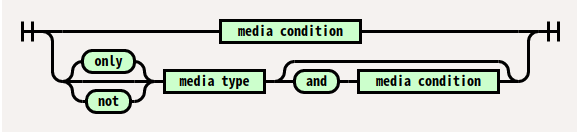

# 18. 레이아웃


레이아웃은 책이나 신문, 잡지 등의 출판물에서 글이나 그림을 효과적으로 정리하고 배치하는 일을 뜻하는 출판용어입니다.

이와같이 웹사이트를 제작할때 메뉴, 컨텐츠, 부가정보 등과 같은 구성요소들을 필요한 곳에 위치하여 사용자가 효과적으로 웹사이트를 이용할 수 있게 배치하는 작업을 일컫습니다.


https://codesandbox.io/s/js-study-8vfze?file=/index.html

## float을 해제하는 방법

```css
.parent::after {
  content: "";
  display: block;
  clear: both;
}
```

<br>
<br>

# 19. 반응형 레이아웃

반응형 웹은 디스플레이 종류에 따라 화면의 크기가 자동으로 최적화되도록 조절되는 웹페이지입니다. 예전의 웹은 무조건 PC에서만 보던 시절이 있었습니다.

이런 환경이 스마트폰의 보급과 함께 많은 부분이 달라졌습니다. 더이상 웹이 PC환경의 전유물이 아닌 모바일과 태블릿 환경 등 더욱 많은 부분에서 동일한 웹을 봐야 하는 상황들이 생기게 됩니다. 하지만 동일한 웹페이지를 여러 환경에서 보기에는 해상도나 동작환경이 다르기 때문에 각 페이지별로 맞춰야 하는 수요가 발생하게 됩니다.

이러한 문제를 해결하는 방법 중의 하나가 반응형 웹디자인(Responsive Web Design)이다.

<br>

## viewport meta tag

meta tag는 브라우저 혹은 검색엔진최적화(SEO)를 위해 검색엔진에게 메타데이터를 전달하기 위해 사용된다.

viewport meta tag는 브라우저의 화면 설정과 관련된 정보를 제공합니다.

```html
<meta name="viewport" content="width=device-width, initial-scale=1.0" />
```

- **width** : viewport의 가로 크기를 조정한다. 일반적인 숫자값이 들어갈 수도 있고, device-width와 같은 특정한 값을 사용할 수도 있다.
- **height** : viewport의 세로 크기를 조정한다.
- **initial-scale** : 페이지가 처음 로딩될 때 줌 레벨을 조정한다.
- **minimum-scale** : viewport의 최소 배율값, 기본값은 0.25이다.
- **maximum-scale** : viewport의 최대 배율값, 기본값은 1.6이다.
- **user-scalable** : 사용자의 확대/축소 기능을 설정, 기본값은 yes이다.

<br>

## @media

`@media`는 미디어 쿼리의 값에 따라 조건부로 스타일을 지정하고 싶을 때 사용합니다.

```html
<link rel="stylesheet" type="text/css" media="screen" href="style.css" />
<link rel="stylesheet" type="text/css" media="print" href="print.css" />
```

```css
@media screen {
  * { font-family: sans-serif }
}
Similarly, stylesheets can be conditionally imported based on media queries:

@import "print-styles.css" print;
```



### 논리 연산자

- **and** 다수의 미디어 특성을 조합하여 하나의 미디어 쿼리를 만들 때 사용
- **not** 미디어 쿼리를 부정
- **only** 전체 쿼리가 일치할 때만 스타일을 적용할 때 사용하며 오래 된 브라우저가 스타일을 잘못 적용하지 못하도록 방지할 때 유용
- **,** 쉼표는 다수의 미디어 쿼리를 하나의 규칙으로 조합할 때 사용(or)

### 미디어 타입

- **all** 모든 타입
- **screen** 프린트, 스피치를 제외한 모든 타입
- **print** 인쇄 결과물 및 출력 미리보기 화면에 표시 중인 문서
- **speech** 음성 합성장치 대상

### 미디어 프로퍼티

- **width**: viewport 너비(px)
- **height**: viewport 높이(px)
- **device-width**: 디바이스의 물리적 너비(px)
- **device-height**: 디바이스의 물리적 높이(px)
- **orientation**: 디바이스 방향 (가로 방향: landscape, 세로방향: portrait)
- **device-aspect-ratio**: 디바이스의 물리적 width/height 비율
- **color**: 디바이스에서 표현 가능한 최대 색상 비트수
- **monochrome**: 흑백 디바이스의 픽셀 당 비트수
- **resolution**: 디바이스 해상도

```css
@media screen and (max-device-width: 768px) and (orientation: landscape) {
  ...;
}
```

<br>

[미디어쿼리](https://codesandbox.io/s/media-miytc?file=/index.html)

<br>
<br>

# 20. 플렉스 박스 레이아웃

## [Flexible Box](https://heropy.blog/2018/11/24/css-flexible-box/)

### [그리드 시스템](https://codesandbox.io/s/imiji-14y7z?file=/index.html)

<br>

# 21. 수평/수직 중앙 정렬

## [포이마웹 21장](https://poiemaweb.com/css3-centering)

### [absolute](https://codesandbox.io/s/imiji-14y7z?file=/index.html)

<br>
<br>

# 22 image 요소 아래에 패딩된 여분의 공간 제거하기

## [포이마웹 22장](https://poiemaweb.com/css3-removing-white-space-image-element)

### [line-height: 0](https://codesandbox.io/s/imiji-14y7z?file=/index.html)
