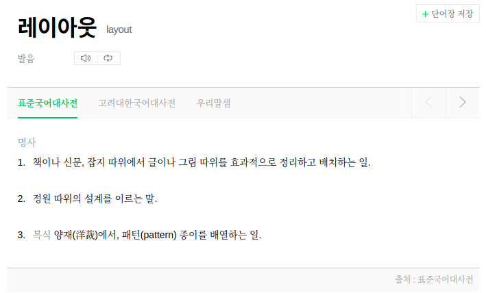
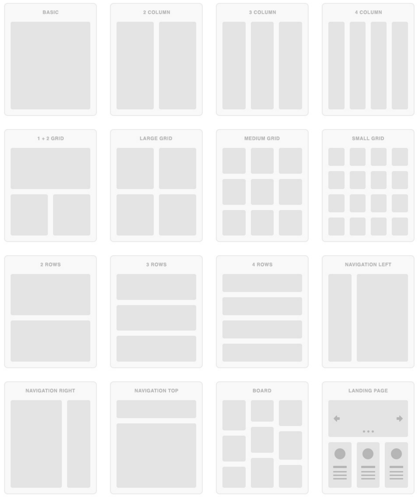

# 18. 레이아웃

레이아웃은 책이나 신문, 잡지 등의 출판물에서 글이나 그림을 효과적으로 정리하고 배치하는 일을 뜻하는 출판용어입니다.

이와같이 웹사이트를 제작할때 메뉴, 컨텐츠, 부가정보 등과 같은 구성요소들을 필요한 곳에 위치하여 사용자가 효과적으로 웹사이트를 이용할 수 있게 배치하는 작업을 일컫습니다.

# 19. 반응형 레이아웃

# 20. 플렉스 박스 레이아웃

# 21. 수평/수직 중앙 정렬

# 22 image 요소 아래에 패딩된 여분의 공간 제거하기
