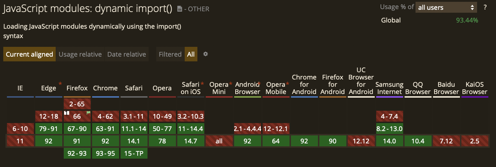

# 8 모듈

모듈이란 파일과 파일간에 어떤 파일의 특정 기능을 사용하고자 할 때 불러들여서 쓸 수 있는 기능입니다.

자바스크립트가 실행되는 방식을 살펴보면 HTML에서 script 태그를 이용해서 불러 왔습니다.

```html
<html>
  <head>
    <script src="my-script.js"></script>
    ...
  </head>
</html>
```

```js
// my-script.js
console.log("HELLO WORLD!");
```

<br>

ES5까지는 모듈에 대한 지원이 되지 않았기 때문에, 모듈과 비슷한 구조를 즉시 실행 함수를 이용해 구현했습니다.

```js
const module = (function () {
  const _str = "모듈 변수";
  return {
    myfunc: function () {
      return _str;
    },
  };
})();
console.log(module.myfunc());
// 모듈 변수
```

반환 받은 객체는 myfunc 메서드를 호출할 수 있고, 클로저이기 때문에 \_str 변수에 접근할 수 있습니다. 따라서 module.myfunc()를 실행하면 "모듈 변수" 문자열을 반환 받게 됩니다. 모듈 외부에서는 \_str 변수에 접근할 수 없습니다.

이러한 방식으로 구현하며 모듈 형태에 대한 니즈가 있다 보니, 결국 ES6에서는 본격적으로 모듈을 지원하게 되었습니다. `import export`를 이용하는 방법입니다.  
구현 방법이 심플하고 명확하므로 가능하면 위와 같은 방식보다는 ES6의 새로운 모듈 작성 방법을 추천합니다.

```js
// moduleA.js
const A = () => {};
export default A;
```

```js
// moduleB.js
export const B = () => {};
```

```js
// index.js
import A from "moduleA";
import { B } from "moduleB";
```

```html
<html>
  <head>
    <script type="module" src="index.js"></script>
  </head>
</html>
```

여기서 눈여겨봐야될 것은 `default` 의 유무인데 `export` 를 사용할 때는 **named export** 와 **default export** 를 사용할 수 있다. 단, default export는 모듈 내에서 한번만 사용할 수 있고 named export는 여러번 사용할 수 있다는 것이다. 그렇게 default export로 내보내면 `import` 에선 내보낸 이름 그대로 바로 사용할 수 있지만, named export로 내보내면 `{ }`로 묶어서 불러와야 한다.

```js
// Header.style.js
const HeaderButton = styled.button`
  text-transform: uppercase;
  font-weight: bold;
  font-size: 1.5rem;
  color: inherit;
  display: ${({ open }) => (open ? "none" : "block")};
`;

export { HeaderButton, ... };
```

```js
// Header.jsx
import * as S from "./Header.style";

const Header = () => {
  return (
    <header>
      <S.HeaderButton open={open}>movie</S.HeaderButton>
    </header>
  );
};
```

<br>

## 모듈의 핵심 기능

- 엄격 모드로 실행됨

모듈은 항상 엄격 모드(use strict)로 실행됩니다. 선언되지 않은 변수에 값을 할당하는 등의 코드는 에러를 발생시킵니다.

```js
<script type="module">a = 5;</script>
// 에러
```

- 모듈 레벨 스코프

모듈은 자신만의 스코프가 있습니다. 따라서 모듈 내부에서 정의한 변수나 함수는 다른 스크립트에서 접근할 수 없습니다.

```html
//index.html
<script type="module" src="user.js"></script>
<script type="module" src="hello.js"></script>
```

```js
//user.js
let user = "John";
```

```js
//hello.js
console.log(user); // user is not defined
```

<br>

## 모듈을 사용하는 이유??

- 유지보수성 : 기능들이 모듈화가 잘 되어있다면, 의존성을 그만큼 줄일 수 있기 때문에 어떤 기능을 개선한다거나 수정할 때 훨씬 편하게 할 수 있다.
- 네임스페이스화 : 자바스크립트에서 전역변수는 전역공간을 가지기 때문에 코드의 양이 많아질수록 겹치는 네임스페이스가 많아질 수 있다. 그러나 모듈로 분리하면 모듈만의 네임스페이스를 갖기 때문에 그 문제가 해결된다.
- 재사용성 : 똑같은 코드를 반복하지 않고 모듈로 분리시켜서 필요할 때마다 사용할 수 있다.

<br>

하지만 이러한 모듈 문법을 사용하기에는 현실적인 문제가 존재합니다.

## 브라우저 호환성 이슈



아직까지 많은 구형 브라우저가 모듈을 지원하지 않는다...

## 최신 문법 사용??

자바스크립트는 ES6 이후로도 많은 최신 문법이 나오고 있다. `import export` 뿐만 아니라 수많은 최신 문법을 브라우저가 지원 안할 수도 있다.

하지만 구형브라우저를 위해 최신문법을 사용하지 않는다는 것은 개발의 생산성과 직결되는 문제!!

하지만 NodeJs와 npm패키지의 등장으로 자바스크립트를 엔지니어링하고자 하는 개발자들이 많아졌고, 그 결과 나온 것이 번들러!

## 번들러

기본적으로 시작되는 자바스크립트 파일 하나를 지정하면, 그 파일 안에서 모듈이란 스펙을 이용해, 다른 파일을 불러오는 구문을 다 분석해서 하나의 자바스크립트 파일로 만들어주는 것을 번들러라고 한다.

그 중에서 가장 많이 사용하는 번들러는 `Webpack`


<br>
<br>

# 9 프로미스

웹페이지는 서버와 통신할 수 있어야합니다. 프론트엔드에서 이 통신을 어떻게 다루는지를 알아야하는데요. 통신이란 것은 실행 시간이 정확히 얼마나 걸릴지 알 수 없는 작업이기 때문에, 프로그래머들은 **프로미스**를 만들었습니다.

## 프로미스가 뭘까?

**프로미스**란 MDN문서에서 아래와 같이 설명하고 있습니다.

> Promise는 프로미스가 생성될 때 꼭 알 수 있지는 않은 값을 위한 대리자로, 비동기 연산이 종료된 이후의 결과값이나 실패 이유를 처리하기 위한 처리기를 연결할 수 있도록 합니다. 프로미스를 사용하면 비동기 메서드에서 마치 동기 메서드처럼 값을 반환할 수 있습니다. 다만 최종 결과를 반환하지는 않고, 대신 프로미스를 반환해서 미래의 어떤 시점에 결과를 제공합니다.

여기서 가장 중요한 것은 **미래의 어떤 시점에 결과를 제공**한다는 것입니다. 이를 한마디로 표현하면 **미랫값**이라고 볼 수 있습니다.

<br>

예를 들면 카페에 가서 🍓딸기라떼를 주문을 하면, 직원은 🛎**진동벨**을 넘겨줍니다. 이 진동벨이 **프로미스**입니다.

이 진동벨은 미래에 내가 딸기라떼를 받을 수 있을 것이라는 **약속**입니다. 이 약속을 기다리면서 다른 일들을 할 수 있습니다. 그리고 진동벨이 울리면 카운터에서 딸기라떼를 받아와 즐길 수 있습니다.

하지만 이런 상황이 발생할 수도 있습니다. 진동벨이 울려서 카운터에 갔더니, "오늘 딸기 재고가 다 떨어져서 주문이 불가능합니다."라고 합니다. 그러면 다른 메뉴를 고민하고 요청하던가 포기해야합니다.

**이처럼 미랫값인 🛎프로미스는 성공할 수도, 실패할 수도 있습니다.**

이런 미랫값을 다루기 위한 프로미스가 등장하기 전에 사용하던 방법은 콜백이었습니다.

```js
setTimeout(
  (name) => {
    let coffeeList = name;
    console.log(coffeeList);

    setTimeout(
      (name) => {
        coffeeList += ", " + name;
        console.log(coffeeList);

        setTimeout(
          (name) => {
            coffeeList += ", " + name;
            console.log(coffeeList);

            setTimeout(
              (name) => {
                coffeeList += ", " + name;
                console.log(coffeeList);
              },
              500,
              "Latte"
            );
          },
          500,
          "Mocha"
        );
      },
      500,
      "Americano"
    );
  },
  500,
  "Espresso"
);
```

콜백 함수는 비동기 데이터를 다루기에 간편하고, 오랜 시간 동안 표준적인 방법이었습니다. 하지만 서비스의 로직이 복잡해지고 여러 비동기 동작들이 필요한 시점부터 비동기 함수에서 다른 비동기 함수를 호출하고, 거기서 또 다른 비동기 함수를 호출하는 등의 중첩이 발생합니다. 이런 경우를 흔히 **'콜백 지옥'** 에 빠졌다고 합니다. 게다가 콜백의 연결은 에러 처리를 하는 경우에서도 상당히 곤란한 상황을 만들어냅니다.

```js
try {
  setTimeout(() => {
    throw new Error("Error!");
  }, 1000);
} catch (e) {
  console.log("에러를 캐치하지 못한다..");
  console.log(e);
}
```

try 블록 내에서 setTimeout 함수가 실행되면 1초 후에 콜백 함수가 실행되고 이 콜백 함수는 예외를 발생시킵니다. 하지만 이 예외는 catch 블록에서 catch되지 않습니다. 이미 try catch 문을 빠져나온 다음에 setTimeout 함수가 1초 뒤에 실행되기 때문입니다.

게다가 보통 비동기 함수들은 두 개의 콜백 함수를 전달받습니다. **요청이 성공한 경우에 실행할 콜백 함수**와 **오류가 발생했을 때 실행할 콜백 함수**가 필요하기 때문입니다. 이로 인해 복잡성이 2배 이상 증가하죠.

<br>

## 그래서 프로미스가 등장했다!

프로미스를 활용하면 콜백 함수 문제를 간편하게 만들 수 있습니다. 프로미스는 콜백 함수를 인자로 받는 대신에, **성공과 실패에 대응하는 메서드**를 제공합니다. 그리고 콜백 함수를 중첩하지 않고, 여러 개의 비동기 동작을 연결할 수 있는 방법을 제공합니다

<br>

## 프로미스의 생성

프로미스는 Promise 생성자 함수를 통해 인스턴스화한다. Promise 생성자 함수는 비동기 작업을 수행할 콜백 함수를 인자로 전달받는데 이 콜백 함수는 resolve와 reject 함수를 인자로 전달받습니다.

`Promise`는 다음 중 하나의 상태를 가집니다.

- 대기(pending): 이행하거나 거부되지 않은 초기 상태.
- 이행(fulfilled): 연산이 성공적으로 완료됨.
- 거부(rejected): 연산이 실패함.

```js
const promise = new Promise((resolve, reject) => {
  //비동기 작업을 수행.

  if(/* 비동기 작업 수행 성공*/)) {
    resolve("result");
  } else { /* 비동기 작업 수행 실패*/
    reject("failure reason");
  }
})
```

<br>

## 프로미스의 후속 처리 메소드

- `then`
- `catch`
- `finally`

### `.then`

`.then`은 프라미스에서 가장 중요하고 기본이 되는 메서드입니다.

```js
let promise = new Promise((resolve, reject) => {
  setTimeout(() => resolve("done!"), 1000);

  or;

  setTimeout(() => reject("reject!"), 1000);
});

promise.then(
  (result) => console.log(result),
  (error) => console.log(error)
);
```

`.then`의 첫 번째 인수는 프라미스가 이행되었을 때 실행되는 함수이고, 여기서 실행 결과를 받습니다.
두 번째 인수는 프라미스가 거부되었을 때 실행되는 함수이고, 여기서 에러를 받습니다.

<br>

### `.catch`

에러가 발생한 경우만 다루고 싶을 때 사용하는 메서드입니다.

```js
let promise = new Promise((resolve, reject) => {
  setTimeout(() => reject(new Error("에러 발생!")), 1000);
});

promise.catch((err) => console.log(err)); // 1초 뒤 "Error: 에러 발생!" 출력
```

### `.finally`

`try {...} catch {...}`에 `finally` 절이 있는 것처럼, 프라미스에도 `finally가` 있습니다.

```js
new Promise((resolve, reject) => {
  setTimeout(() => reject(new Error("에러 발생!")), 1000);
})
  // 성공·실패 여부와 상관없이 프라미스가 처리되면 실행됨
  .finally(() => console.log("무조건 실행!"))
  .then((result) => console.log(result))
  .catch((err) => console.error(err));
```

프로미스는 비동기 작업을 전달받아서 응답에 따라 두 가지 메서드 중 하나를 호출하는 객체입니다. 프라미스는 비동기 작업이 성공하거나 충족된 경우 then() 메서드에 결과를 넘겨줍니다. 비동기 작업에 실패하거나 거부되는 경우에는 catch() 메서드를 호출합니다.

프로미스는 두 개의 인자, resolve() 와 reject() 를 전달받습니다. resolve()는 코드가 정상적으로 동작했을 때 실행합니다. reject()는 코드가 정상적으로 동작하지 않았을 때 실행합니다.


<br>

## 프로미스 메서드

프로미스는 주로 생성자 함수로 사용되지만 함수도 객체이므로 메소드를 갖을 수 있다.

- `Promise.resolve, Promise.reject`

```js
const resolvedPromise = Promise.resolve([1, 2, 3]);
resolvedPromise.then(console.log); // [ 1, 2, 3 ]

const resolvedPromise = new Promise((resolve) => resolve([1, 2, 3]));
resolvedPromise.then(console.log); // [ 1, 2, 3 ]

const rejectedPromise = Promise.reject(new Error("Error!"));
rejectedPromise.catch(console.log); // Error: Error!

const rejectedPromise = new Promise((resolve, reject) =>
  reject(new Error("Error!"))
);
rejectedPromise.catch(console.log); // Error: Error!
```

- `Promise.all`

  Promise.all 메소드는 프로미스가 담겨 있는 배열 등의 이터러블을 인자로 전달 받는다. 그리고 전달받은 모든 프로미스를 병렬로 처리하고 그 처리 결과를 resolve하는 새로운 프로미스를 반환합니다.

```js
Promise.all([
  new Promise((resolve) => setTimeout(() => resolve(1), 3000)), // 1
  new Promise((resolve) => setTimeout(() => resolve(2), 2000)), // 2
  new Promise((resolve) => setTimeout(() => resolve(3), 1000)), // 3
])
  .then(console.log) // [ 1, 2, 3 ]
  .catch(console.log);
```

- `Promise.allSettled`

`Promise.allSettled` 메소드는 배열이나 별도의 나열 가능한 객체를 통해 나열된 Promise모음이 모두 이행하거나 거부했을 때에 대한 대응을 할 수 있는 Promise 객체를 반환한다.

```js
const promise1 = Promise.resolve(3);
const promise2 = new Promise((resolve, reject) =>
  setTimeout(reject, 1000, "foo")
);
const promises = [promise1, promise2];

Promise.allSettled(promises).then((results) => console.log(results));
);

/*
[
  { status: 'fulfilled', value: 3 },
  { status: 'rejected', reason: 'foo' }
]
*/
```

- `Promise.race`

`Promise.race` 메소드는 Promise 객체를 반환합니다. 이 프로미스 객체는 iterable 안에 있는 프로미스 중에 가장 먼저 완료된 것의 결과값을 반환합니다.

```js
const promise1 = new Promise((resolve, reject) => {
  setTimeout(resolve, 500, "one");
});

const promise2 = new Promise((resolve, reject) => {
  setTimeout(resolve, 100, "two");
});

Promise.race([promise1, promise2])
  .then((value) => {
    console.log(value);
    // 두 Promise 중 빠른 것을 Value를 리턴
  })
  .catch((err) => console.log("에러! " + err));
```

- `Promise.any`

  `Promise.any` 메소드는 Promise 객체를 반환합니다. 이 프로미스 객체는 iterable 안에 있는 프로미스 중에 가장 먼저 성공한 하나의 프로미스를 반환합니다.

```js
const promise1 = new Promise((resolve, reject) => {
  setTimeout(resolve, 500, "one");
});

const promise2 = new Promise((resolve, reject) => {
  setTimeout(reject, 300, "two");
});

Promise.any([promise1, promise2])
  .then((value) => {
    console.log(value);
    // 성공한 Promise 값을 리턴
  })
  .catch((err) => console.log("에러! " + err));
```

<br>
<br>

# 10 7번째 타입 심볼

심볼(symbol)은 ES6에서 새롭게 추가된 7번째 타입으로 변경 불가능한 원시 타입의 값이다. 심볼은 주로 이름의 충돌 위험이 없는 유일한 객체의 프로퍼티 키(property key)를 만들기 위해 사용한다.

## 심볼의 생성

'심볼(symbol)'은 유일한 식별자(unique identifier)를 만들고 싶을 때 사용합니다.

`Symbol()`을 사용하면 심볼값을 만들 수 있습니다.

```js
const id = Symbol("id");
const id2 = Symbol("id");

console.log(id === id2); // false
```

## 숨김 프로퍼티

심볼을 이용하면 ‘숨김(hidden)’ 프로퍼티를 만들 수 있습니다. 숨김 프로퍼티는 외부 코드에서 접근이 불가능하고 값도 덮어쓸 수 없는 프로퍼티입니다.

```js
const user = {
  // 서드파티 코드에서 가져온 객체
  name: "John",
};

const id = Symbol("id");
const id2 = Symbol("id");

user[id] = 1;
user[id2] = 3;
console.log(user);
// { name: 'John', [Symbol(id)]: 1, [Symbol(id)]: 3 }
```

## 전역 심볼

심볼은 이름이 같더라도 모두 별개로 취급됩니다. 그런데 이름이 같은 심볼이 같은 개체를 가리키길 원하는 경우도 가끔 있습니다.

전역 심볼 레지스트리(global symbol registry) 는 이런 경우를 위해 만들어졌습니다. 전역 심볼 레지스트리 안에 심볼을 만들고 해당 심볼에 접근하면, 이름이 같은 경우 항상 동일한 심볼을 반환합니다.

- `Symbol.for`

레지스트리 안에 있는 심볼을 읽거나, 새로운 심볼을 생성하려면 Symbol.for(key)를 사용하면 됩니다.

```js
// 전역 레지스트리에서 심볼을 읽습니다.
const id = Symbol.for("id"); // 심볼이 존재하지 않으면 새로운 심볼을 만듭니다.

// 동일한 이름을 이용해 심볼을 다시 읽습니다(좀 더 멀리 떨어진 코드에서도 가능합니다).
const idAgain = Symbol.for("id");

// 두 심볼은 같습니다.
console.log(id === idAgain); // true
```

- `Symbol.keyFor`

전역 심볼을 찾을 때 사용되는 Symbol.for(key)에 반대되는 메서드도 있습니다. Symbol.keyFor(sym)를 사용하면 이름을 얻을 수 있습니다.

```js
// 이름을 이용해 심볼을 찾음
const sym = Symbol.for("name");
const sym2 = Symbol.for("id");

// 심볼을 이용해 이름을 얻음
alert(Symbol.keyFor(sym)); // name
alert(Symbol.keyFor(sym2)); // id
```

## 시스템 심볼

'시스템 심볼(system symbol)'은 자바스크립트 내부에서 사용되는 심볼입니다. 시스템 심볼을 활용하면 객체를 미세 조정할 수 있습니다.

Well-Known Symbol은 자바스크립트 엔진에 상수로 존재하며 자바스크립트 엔진은 Well-Known Symbol을 참조하여 일정한 처리를 한다.

- `Symbol.iterator`
- `Symbol.match`
- ...

<br>
<br>

# 11 이터레이션과 for...of문

ES6에서 도입된 이터레이션 프로토콜은 데이터 컬렉션을 순회하기 위한 미리 약속된 규칙입니다. 이터레이션 프로토콜을 준수한 객체는 for…of 문으로 순회할 수 있고 Spread 문법의 피연산자가 될 수 있다.

이터레이션 프로토콜에는 이터러블 프로토콜(iterable protocol)과 이터레이터 프로토콜(iterator protocol)이 있다.

## 이터러블 프로토콜

<b>이터러블 프로토콜(iterable protocol)</b>은 `for...of`와 같은 순회하는 행위를 정의하거나 커스터마이징 할 수 있게 도와줍니다.

몇몇의 빌트인 객체는 자체적인 이터레이션을 가지고 있습니다. 대표적으로 Array, Map등이 존재하고 일반 Object는 가지고 있지 않습니다.

**iterable**하기 위해서는 반드시 <b>`@@iterator`</b>메서드가 구현되어있거나 프로토타입 체인에 의해 상속되어야합니다.  
그리고 <b>`@@iterator`</b>메서드는 <b>`Sysbol.iterator`</b>에 의해서 구현할 수 있습니다.

`Sysbol.iterator` - iterator 프로토콜을 준수하는 객체를 반환하는 인수가 없는 함수

```js
const array = [1, 2, 3];

// 배열은 Symbol.iterator 메소드를 소유한다.
// 따라서 배열은 이터러블 프로토콜을 준수한 이터러블이다.
console.log(Symbol.iterator in array); // true

// 이터러블 프로토콜을 준수한 배열은 for...of 문에서 순회 가능하다.
for (const item of array) {
  console.log(item);
}

const obj = { a: 1, b: 2 };

// 일반 객체는 Symbol.iterator 메소드를 소유하지 않는다.
// 따라서 일반 객체는 이터러블 프로토콜을 준수한 이터러블이 아니다.
console.log(Symbol.iterator in obj); // false

// 이터러블이 아닌 일반 객체는 for...of 문에서 순회할 수 없다.
// TypeError: obj is not iterable
for (const p of obj) {
  console.log(p);
}
```

<br>

## 이터레이터 프로토콜

<b>이터레이터 프로토콜(iterator protocol)</b>은 어떤 값들의 순서를 만드는 표준적인 방법을 정의하고, 모든 값이 생성되었을 때 잠재적으로 반환값을 정의합니다.

객체에 아래와 같은 규칙으로`next()`메서드가 구현되어졌을 때 이터레이터 객체다라고 불립니다.

`next()`

0개 또는 1개의 인수가 있는 함수로, `done`과 `value` 두가지 프로퍼티를 가진 개체를 반환해야합니다.

```js
const str = new String("hi");

console.log([...str]); // [ 'h', 'i' ]

str[Symbol.iterator] = function () {
  return {
    // 이 이터레이터 객체는 "bye"라는 하나의 요소를 리턴한다.
    _first: true,
    next: function () {
      return this._first
        ? {
            value: "bye",
            done: (this._first = false),
          }
        : {
            done: true,
          };
    },
  };
};
console.log([...str]); // [ 'bye' ]
```

<br>

## 무한 이터러블과 Lazy evaluation(지연 평가)

무한 이터러블(infinite sequence)을 생성하는 함수를 정의해보자. 이를 통해 무한 수열(infinite sequence)을 간단히 표현할 수 있다.

```js
// 무한 이터러블을 생성하는 함수
const fibonacciFunc = function () {
  let [pre, cur] = [0, 1];

  return {
    [Symbol.iterator]() {
      return this;
    },
    next() {
      [pre, cur] = [cur, pre + cur];
      return { value: cur };
    },
  };
};

// fibonacciFunc 함수는 무한 이터러블을 생성한다.
for (const num of fibonacciFunc()) {
  if (num > 10000) break;
  console.log(num); // 1 2 3 5 8...
}

// 무한 이터러블에서 3개만을 취득한다.
const [f1, f2, f3] = fibonacciFunc();
console.log(f1, f2, f3); // 1 2 3
```

지연 평가

> 컴퓨터 프로그래밍에서 느긋한 계산법(Lazy evaluation)은 계산의 결과 값이 필요할 때까지 계산을 늦추는 기법이다. - Wikipedia

fibonacciFunc 함수가 생성한 무한 이터러블은 for…of 문이나 디스트럭처링 할당이 실행되기 이전까지 데이터를 생성하지는 않는다. for…of 문의 경우, 이터러블을 순회할 때 내부에서 이터레이터의 next 메소드를 호출하는데 바로 이때 데이터가 생성된다. next 메소드가 호출되기 이전까지는 데이터를 생성하지 않는다. 즉, 데이터가 필요할 때까지 데이터의 생성을 지연하다가 데이터가 필요한 순간 데이터를 생성한다.

<br>

## 이터레이션 프로토콜의 필요성

> Array, String, Map, Set, DOM data structure(NodeList, HTMLCollection), Arguments

위 데이터 소스는 모두 이터레이션 프로토콜을 준수하는 이터러블이다. 즉, 이터러블은 데이터 공급자(Data provider)의 역할을 한다.

만약 다양한 데이터 소스가 각자의 순회 방식을 갖는다면 데이터 소비자는 다양한 데이터 소스의 순회 방식을 모두 지원해야 한다. 이는 효율적이지 않다. 하지만 다양한 데이터 소스가 이터레이션 프로토콜을 준수하도록 규정하면 데이터 소비자는 이터레이션 프로토콜만을 지원하도록 구현하면 된다.

즉, 이터레이션 프로토콜은 다양한 데이터 소스가 하나의 순회 방식을 갖도록 규정하여 데이터 소비자가 효율적으로 다양한 데이터 소스를 사용할 수 있도록 데이터 소비자와 데이터 소스를 연결하는 인터페이스의 역할을 한다.


<br>
<br>

# 12 제너레이터와 async/await

ES6에서 도입된 제너레이터(Generator) 함수는 이터러블을 생성하는 함수이다. 제너레이터 함수를 사용하면 이터레이션 프로토콜을 준수해 이터러블을 생성하는 방식보다 간편하게 이터러블을 구현할 수 있다.

## 제너레이터 함수

제너레이터를 만들려면 '제너레이터 함수’라 불리는 특별한 문법 구조, <b>function\*</b>이 필요합니다.

```js
function* counter() {
  console.log("첫번째 호출");
  yield 1; // 첫번째 호출 시에 이 지점까지 실행된다.
  console.log("두번째 호출");
  yield 2; // 두번째 호출 시에 이 지점까지 실행된다.
  console.log("세번째 호출"); // 세번째 호출 시에 이 지점까지 실행된다.
}

const generatorObj = counter();

console.log(generatorObj.next()); // 첫번째 호출 {value: 1, done: false}
console.log(generatorObj.next()); // 두번째 호출 {value: 2, done: false}
console.log(generatorObj.next()); // 세번째 호출 {value: undefined, done: true}

const generatorObj2 = counter();
console.log([...generatorObj2]); // [1, 2]
```

## 제너레이터의 활용

제너레이터 함수를 사용하면 이터레이션 프로토콜을 준수해 이터러블한 객체를 생성하는 방식보다 간편하게 구현 가능합니다.

```js
// 무한 이터러블을 생성하는 함수
const fibonacciFunc = function () {
  let [pre, cur] = [0, 1];

  return {
    [Symbol.iterator]() {
      return this;
    },
    next() {
      [pre, cur] = [cur, pre + cur];
      return { value: cur };
    },
  };
};

// 무한 이터러블을 생성하는 함수
const fibonacciFunc = function* () {
  let [pre, cur] = [0, 1];

  while (true) {
    [pre, cur] = [cur, pre + cur];
    yield cur;
  }
};
```

```js
function* watchGenerator() {
  console.log("모니터링 시작!");
  while (true) {
    const action = yield;
    if (action.type === "HELLO") {
      console.log("안녕하세요?");
    }
    if (action.type === "BYE") {
      console.log("안녕히가세요.");
    }
  }
}

const watch = watchGenerator();

watch.next(); // 모니터링 시작!
watch.next({ type: "HELLO" }); // 안녕하세요?
watch.next({ type: "BYE" }); // 안녕히가세요.
```

<br>

## 비동기 처리

제너레이터를 사용해 비동기 처리를 동기 처리처럼 구현할 수 있다. 다시 말해 비동기 처리 함수가 처리 결과를 반환하도록 구현할 수 있다.

```js
function getUser(genObj, username) {
  fetch(`https://api.github.com/users/${username}`)
    .then((res) => res.json())
    // ① 제너레이터 객체에 비동기 처리 결과를 전달한다.
    .then((user) => genObj.next(user.name));
}

// 제너레이터 객체 생성
const g = (function* () {
  let user;
  // ② 비동기 처리 함수가 결과를 반환한다.
  // 비동기 처리의 순서가 보장된다.
  user = yield getUser(g, "jeresig");
  console.log(user); // John Resig

  user = yield getUser(g, "ahejlsberg");
  console.log(user); // Anders Hejlsberg

  user = yield getUser(g, "ungmo2");
  console.log(user); // Ungmo Lee
})();

// 제너레이터 함수 시작
g.next();
```

<br>

## Async Await

프로미스는 **async/await**을 이용해서 더욱 편하게 다룰 수 있게 발전했습니다.

프로미스는 콜백과 비교하면 엄청난 발전이지만, 인터페이스가 여전히 다소 투박합니다. 그리고 프로미스를 사용해도 여전히 메서드에서 콜백을 다뤄야 합니다.

async 키워드를 이용해서 선언한 함수는 비동기 데이터를 사용한다는 것을 의미합니다. 비동기 함수의 내부에서 await 키워드를 사용하면 값이 반환될 때까지 함수의 실행을 중지시킬 수 있습니다.

```js
function getUser(username) {
  return fetch(`https://api.github.com/users/${username}`)
    .then((res) => res.json())
    .then((user) => user.name);
}

async function getUserAll() {
  let user;
  user = await getUser("jeresig");
  console.log(user);

  user = await getUser("ahejlsberg");
  console.log(user);

  user = await getUser("ungmo2");
  console.log(user);
}

getUserAll();
```

비동기 함수의 재밌는 점은 프로미스로 변환된다는 것입니다. 즉 getUser()을 호출하는 경우 then() 메서드가 필요합니다. 뭔가 크게 달라진 것 같지 않을 수 있는데, async 함수가 빛나는 때는 여러 개의 프로미스를 다룰 때입니다.

```js
async function getArtistPreference() {
  const theme = await getUserPreferences();
  const album = await getMusic(theme);
  const artist = await getArtist(album);
  return artist;
}

getArtistPreference()
  .then((artist) => console.log(artist))
  .catch((error) => console.error(error));
```
