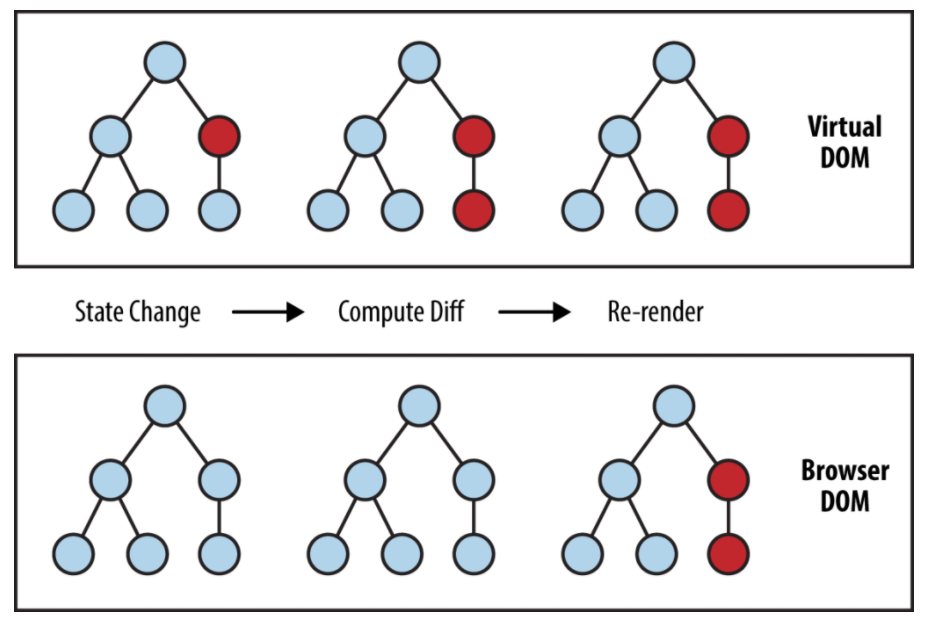
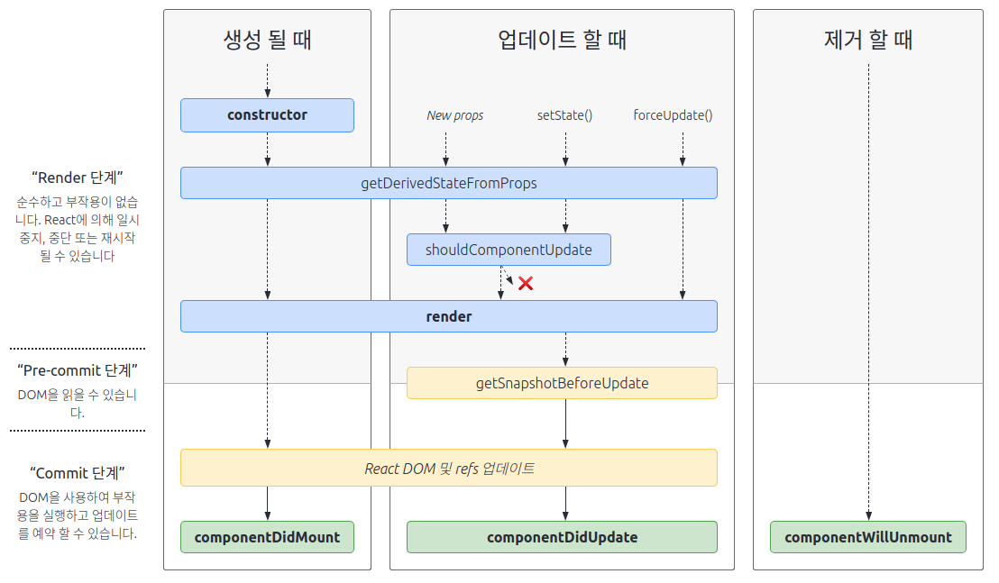
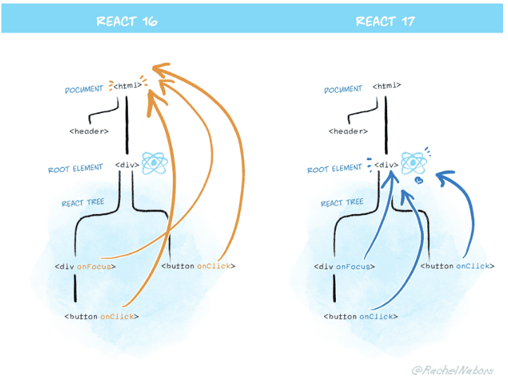

# React.js

React나 Vue같은 라이브러리의 가장 큰 특징은 유저 인터페이스를 **상태**로
관리할 수 있다는 점입니다.

브라우저는 DOM을 통해 웹 페이지를 렌더링 하는데 이 과정을 자바스크립트로 표현해보면,

```js
let data = "Hello World"; // (1)
const title = document.createElement("h1"); // (2)
document.body.appendChild(title); // (3)
title.textContent = data; // (4)
```

(1) 데이터를 준비한다.  
(2) 문자열을 출력할 엘리먼트를 생성한다.  
(3) 기존 문서에 추가한다.  
(4) 엘리먼트의 텍스트를 준비한 데이터로 설정한다.

만약 위 데이터를 수정하고 화면에 반영하려면 두 가지 작업이 필요합니다.

```js
data = "안녕하세요"; // (1)
title.textContent = data; // (2)
```

(1) 데이터를 수정한다.  
(2) 수정한 값을 엘리먼트에 반영한다.

위 방식을 조금 더 개선해서 data변수에 값을 변경하면 title 엘리먼트의 내용도 변경되도록 data변수와 title엘리먼트를 연결지어 보겠습니다. 그러면 data는 UI**상태**를 담는 역할이라고 할 수 있을겁니다.

<br>

## 리액티브

```js
const state = { _data: "Hello World" }; // (1)

const h1 = document.createElement("h1");
document.body.appemChild(h1);

const render = () => (h1.textContent = state.data); // (2)
```

전 코드와 달라진 점은 상태를 의미하는 state라는 이름의 객체를 만들어 그 안에 `data`키와 함께 `Hello World`를 넣어두었습니다.

(1) 이전의 data변수를 객체로 감쌌습니다.

엘리먼트에 상태값을 반영하는 `render()`함수를 만들었습니다.

(2)`render()` 함수로 state.data의 값을 엘리먼트에 반영할 수 있게 만들었습니다.

<br>

`Object.defineProperty()`함수를 이용해서 state에 data속성을 정의해보겠습니다.

```js
Object.defineProperty(state, "data", {
  get() {
    return state._data;
  },

  set(value) {
    state._data = value;
    render();
  },
});
```

```js
// 데이터를 가지는 상태 객체
const state = { _data: "Hello World" };

// 엘리먼트를 준비한다
const h1 = document.createElement("h1");
document.body.appendChild(h1);

// DOM에 변경된 내용을 반영하는 함수
const render = () => (h1.textContent = state.data);

// state.data 속성을 추가한다. 게터/세터를 만든다.
Object.defineProperty(state, "data", {
  get() {
    return state._data;
  },
  set(value) {
    state._data = value;
    render();
  },
});

// "Hello World" 가 출력된다.
render();

setTimeout(() => {
  // state.data 값을 변경하는 것만으로 "안녕하세요"가 화면에 출력된다.
  state.data = "안녕하세요";
}, 1000);
```

이전에는 데이터와 엘리먼트를 같이 변경하면서 화면을 제어했지만, 현재 코드는 데이터만 제어하면 자동으로 화면까지 반응합니다.

이렇게 특정 상태에 의존해 자동으로 반응하는 것을 **리액티브**하다고 표현합니다.

리액트를 비롯한 모던 UI 라이브러리는 이러한 리액티브한 특징을 가지고 있다. MVC 모델에서는 컨트롤러가 데이터와 뷰를 직접 관리한다. 어플리케이션을 동작시킬 때 모델도 변경하고 뷰도 빠짐없이 챙겨야하는 것이다.

한편 UI 상태를 나타내는 것을 뷰모델(View Model, 줄여서 VM)이라고 하는데 컨트롤러의 역할을 뷰모델이 일부 대체한다. 뷰모델을 변경하는 것만으로 UI를 자동으로 갱신하기 때문이다.

<br>

## 가상돔

가상돔을 이해하기 위해서 브라우저의 로딩과정을 간략하게 알아보자.

(1) DOM, CSSOM 파싱 - 브라우저가 HTML을 파싱하고 **DOM트리**를, CSS파일과 inline 스타일을 파싱하여 **CSSOM 트리** 생성  
(2) 렌더트리 - DOM트리와 CSSOM트리가 생성되면 스타일을 매칭시켜주는 과정을 거쳐 **렌더 트리**를 구성  
(3) 레이아웃 (reflow) - 각 노드들의 스크린에서의 좌표에 따라 위치 결정  
(4) 페인트 (repaint) - 실제 화면에 표시

<br>

브라우저에서 제일 성능을 많이 잡아먹는 것은 <b>렌더링과정</b> 특히 reflow가 순간적으로 많이 발생할 경우가 가장 치명적입니다.

특히 최근에는 SPA구조의 등장으로 인해 **DOM의 조작에 대한 복잡도**가 날로 증가하고 있고, 복잡도가 증가한다는 것은 **DOM의 변화가 기하급수적으로 많이 발생**한다는 것입니다.

그리고 앞선 내용을 통해 DOM에 변경이 있을 경우 **렌더트리를 재생성**하고 **레이아웃**을 만들고 **페인팅을 하는 과정**이 다시 **반복**되는 것을 알 수 있습니다. 즉, **브라우저가 연산을 많이 해야한다**는 이야기이고, 전체적인 프로세스를 **비효율적**으로 만든다는 것입니다.

그래서 등장한 개념이 **가상돔**입니다.



뷰(HTML)에 변화가 있을 때, 구 가상돔과 새 가상돔을 비교하여 **변경된 내용만 DOM에 적용**한다. 이를 통해 **브라우저 내에서 발생하는 연산의 양(정확히는 렌더링 과정)을 줄이면서 성능이 개선**되는 것 입니다.

더 쉽게 말하자면 변화를 모아서 한 번에 처리하는 일종의 Batch 작업입니다.

가상돔의 개념에 대해 알아봤으니 생김새를 살펴보면,

```html
<ul id="items">
  <li>item 1</li>
  <li>item 2</li>
</ul>
```

```js
let domNode = {
  type: "ul",
  props: {
    id: "items",
    children: [
      { tagName: "li", textContent: "item 1" },
      { tagName: "li", textContent: "item 2" },
    ],
  },
};
```

코드를 보면 알겠지만, 가상돔은 거창한게 아니라 DOM의 형태를 본따 만든 객체 덩어리다.

트리 구조의 돔과 유사한 가상돔(Vritual DOM)을 만들어 메모리상에서 관리할 수 있게 하였습니다. 즉, 어플리케이션에서 화면 변경을 돔에게 직접 요청하는 것이 아니라 가상돔에게 요청하고, 차이가 있는 부분만 실제 돔에 반영하고 차이가 없으면 렌더링 요청이 있더라도 무시하는 방식으로 성능을 낸다.

그리고 리액트는 가상돔을 이용하는 대표적인 자바스크립트 라이브러리입니다.
리액트 공식 문서에서는 가상돔을 아래와 같이 표현합니다.

> Virtual DOM (VDOM)은 UI의 이상적인 또는 **가상**적인 표현을 메모리에 저장하고 ReactDOM과 같은 라이브러리에 의해 **실제** DOM과 동기화하는 프로그래밍 개념입니다. 이 과정을 재조정이라고 합니다.

<br>

## JSX 등장

앞서 다룬 가상돔(VirtualDOM)의 문제는 바로 가독성이다. 이를 해결하기 위해 jsx라는 것이 등장했습니다.

JSX는 Javascript의 확장문법입니다. 하지만 생김새는 HTML와 많이 닮아있습니다.

```jsx
function Component() {
  return (
    <div className="wooseok">
      <h1>하이!</h1>
    </div>
  );
}

function Component() {
  return React.createElement(
    "div",
    {
      className: "wooseok",
    },
    React.createElement("h1", null, "하이!")
  );
}
```

간단한 JSX를 컴포넌트에서 리턴시키면 Babel은 JSX를 `React.createElement()`호출로 컴파일합니다.

또한 `React.createElement()`로 호출된 react elements는 내부적으로 아래와 같은 객체로 표현됩니다.

```jsx
let element = {
  type: "div",
  props: {
    className: "wooseok",
    children: [{ type: "li", children: "하이!" }],
  },
};
```

또한 리액트 엘리먼트를 가상돔으로 만들어 실제 돔에 반영해 주는 것이 바로 ReactDOM의 역할입니다.

```js
let element = {
  type: "div",
  props: {
    className: "wooseok",
    children: [{ type: "li", children: "하이!" }],
  },
};

ReactDOM.render(element, document.querySelector("#app"));
```

### JSX는 주입 공격을 방지합니다

```js
const title = response.potentiallyMaliciousInput;
// 이것은 안전합니다.
const element = <h1>{title}</h1>;
```

기본적으로 React DOM은 JSX에 삽입된 모든 값을 렌더링하기 전에 이스케이프 하므로, 애플리케이션에서 명시적으로 작성되지 않은 내용은 주입되지 않습니다. 모든 항목은 렌더링 되기 전에 문자열로 변환됩니다. 이런 특성으로 인해 XSS (cross-site-scripting) 공격을 방지할 수 있습니다.

<br>
<br>

# 4. Components와 Props

> 컴포넌트를 통해 UI를 재사용 가능한 개별적인 여러 조각으로 나누고, 각 조각을 개별적으로 살펴볼 수 있습니다.

엘리먼트가 리액트 앱을 구성하는 최소단위라면, **컴포넌트는 UI를 나타내는 엘리먼트와 어플리케이션 로직을 포함한 상위 개념**이다. 로직은 컴포넌트의 상태를 변경하면서 UI 엘리먼트를 제어하는 것입니다.

<br>

## 함수 컴포넌트와 클래스 컴포넌트

```js
function Welcome(props) {
  return <h1>Hello, {props.name}</h1>;
}

class Welcome extends Component {
  render() {
    return <h1>Hello, {this.props.name}</h1>;
  }
}
```

React 엘리먼트는 사용자 정의 컴포넌트로도 나타낼 수 있습니다.

```js
function Welcome(props) {
  return <h1>Hello, {props.name}</h1>;
}

const element = <Welcome name="Seo" />;
ReactDOM.render(element, document.getElementById("root")); // Hello, Seo 렌더링
```

> 주의: 컴포넌트의 이름은 항상 대문자로 시작합니다.

React는 소문자로 시작하는 컴포넌트를 DOM 태그로 처리합니다. 예를 들어 \<div \/>는 HTML div 태그를 나타내지만, \<Welcome \/> 은 컴포넌트를 나타내며 범위 안에 Welcome이 있어야 합니다.

<br>

## props는 읽기 전용입니다.

함수 컴포넌트나 클래스 컴포넌트 모두 컴포넌트의 자체 props를 수정해서는 안 됩니다. 다음 sum 함수를 살펴봅시다.

```js
function sum(a, b) {
  return a + b;
}
```

이런 함수들은 순수 함수라고 호칭합니다. 입력값을 바꾸려 하지 않고 항상 동일한 입력값에 대해 동일한 결과를 반환하기 때문입니다.

반면에 다음 함수는 자신의 입력값을 변경하기 때문에 순수 함수가 아닙니다.

```js
function withdraw(account, amount) {
  account.total -= amount;
}
```

<br>
<br>

# 5. State and Lifecycle



## **마운트**

먼저 마운트될 때 발생하는 생명주기들을 알아봅시다.

- `constructor`
- `getDerivedStateFromProps`
- `render`
- `componentDidMount`

<br>

## `constructor()`

React 컴포넌트의 생성자는 해당 컴포넌트가 마운트되기 전에 호출됩니다. React.Component를 상속한 컴포넌트의 생성자를 구현할 때에는 다른 구문에 앞서 super(props)를 호출해야 합니다. 그렇지 않으면 this.props가 생성자 내에서 정의되지 않아 버그로 이어질 수 있습니다.

React에서 생성자는 보통 아래의 두 가지 목적을 위하여 사용됩니다:

- this.state에 객체를 할당하여 지역 state를 초기화
- 인스턴스에 이벤트 처리 메서드를 바인딩

```js
constructor(props) {
  super(props);
  this.state = { counter: 0 };
  this.handleClick = this.handleClick.bind(this);
}
```

<br>

## `getDerivedStateFromProps(props, state)`

getDerivedStateFromProps 는 props 로 받아온 것을 state 에 넣어주고 싶을 때 사용합니다.

```js
static getDerivedStateFromProps(props, state) {
    if (props.color !== state.color) {
      return { color: props.color };
    }
    return null;
  }
```

다른 생명주기 메서드와는 달리 앞에 static 을 필요로 하고, 이 안에서는 this를 조회 할 수 없습니다. 여기서 특정 객체를 반환하게 되면 해당 객체 안에 있는 내용들이 컴포넌트의 state 로 설정이 됩니다. 반면 null 을 반환하게 되면 아무 일도 발생하지 않습니다.

<br>

## `componentDidMount()`

`componentDidMount()`는 컴포넌트가 마운트된 직후 호출됩니다. DOM 노드가 있어야 하는 초기화 작업은 이 메서드에서 이루어지면 됩니다.

DOM 을 사용해야하는 외부 라이브러리 연동을 하거나, 해당 컴포넌트에서 필요로하는 데이터를 요청하기 위해 axios, fetch 등을 통하여 ajax 요청을 하거나, DOM 의 속성을 읽거나 직접 변경하는 작업을 진행합니다.

<br>

## 업데이트

- getDerivedStateFromProps
- shouldComponentUpdate
- render
- getSnapshotBeforeUpdate
- componentDidUpdate

## `shouldComponentUpdate(nextProps, nextState)`

`shouldComponentUpdate()`는 props 또는 state가 새로운 값으로 갱신되어서 렌더링이 발생하기 직전에 호출됩니다. 기본값은 true입니다. 이 메서드는 초기 렌더링 또는 forceUpdate()가 사용될 때에는 호출되지 않습니다.

이 메서드는 오직 **성능 최적화**만을 위한 것입니다.

this.props와 nextProps, 그리고 this.state와 nextState를 비교한 뒤 false를 반환하는 것으로 React가 갱신 작업을 건너뛰게 만들 수 있습니다.

  <br>
  
## shouldComponentUpdate In Action
  
각 항목에 대해 SCU는 shouldComponentUpdate가 반환한 것을 나타내며, vDOMEq는 React 엘리먼트가 동일한지 여부를 표시합니다. 마지막으로 원의 색은 컴포넌트를 조정해야 하는지 여부를 나타냅니다.
  
  
  
  shouldComponentUpdate는 C2에 뿌리를 둔 하위트리에서 false를 반환했기 때문에 React는 C2를 렌더링하려고 시도하지 않았으므로 C4 및 C5에서 shouldComponentUpdate를 호출할 필요가 없었습니다.
  
  C1과 C3의 경우 shouldComponentUpdate가 true를 반환했으므로 React가 트리의 가장 하위에 가서 확인해야 했습니다. C6의 경우 shouldComponentUpdate는 true를 반환했고 렌더링 된 엘리먼트는 동일하지 않기 때문에 React는 DOM을 업데이트해야 했습니다.
  
  C8입니다. React는 이 컴포넌트를 렌더링 해야 했지만 이전에 렌더링 된 React 엘리먼트와 동일했기 때문에 DOM을 업데이트할 필요가 없었습니다.
  
<br>

## `getSnapshotBeforeUpdate`

`getSnapshotBeforeUpdate` 는 컴포넌트에 변화가 일어나기 직전의 DOM 상태를 가져와서 특정 값을 반환하면 그 다음 발생하게 되는 componentDidUpdate 함수에서 받아와서 사용을 할 수 있습니다.

```js
getSnapshotBeforeUpdate(prevProps, prevState) {
  if (prevProps.color !== this.props.color) {
    return this.myRef.style.color;
  }
  return null;
}
```

<br>

## `componentDidUpdate(prevProps, prevState, snapshot)`

`componentDidUpdate` 는 리렌더링이 마치고, 화면에 우리가 원하는 변화가 모두 반영되고 난 뒤 호출되는 메서드입니다. 3번째 파라미터로 `getSnapshotBeforeUpdate` 에서 반환한 값을 조회 할 수 있습니다.

컴포넌트가 갱신되었을 때 DOM을 조작하기 위하여 이 메서드를 활용하면 좋습니다.

```js
componentDidUpdate(prevProps) {
// 전형적인 사용 사례 (props 비교를 잊지 마세요)
  if (this.props.userID !== prevProps.userID) {
    this.fetchData(this.props.userID);
  }
}
```

> `componentDidUpdate()`는 `shouldComponentUpdate()`가 false를 반환하면 호출되지 않습니다.

<br>

## `componentWillUnmount()`

`componentWillUnmount()`는 컴포넌트가 마운트 해제되어 제거되기 직전에 호출됩니다. 이 메서드 내에서 타이머 제거, 네트워크 요청 취소, componentDidMount() 내에서 생성된 구독 해제 등 필요한 모든 정리 작업을 수행하세요.

이제 컴포넌트는 다시 렌더링되지 않으므로, `componentWillUnmount()` 내에서 setState()를 호출하면 안 됩니다. 컴포넌트 인스턴스가 마운트 해제되고 나면, 절대로 다시 마운트되지 않습니다.

<br>

## **언마운트**

언마운트라는것은, 컴포넌트가 화면에서 사라지는것을 의미합니다. 언마운트에 관련된 생명주기 메서드는 `componentWillUnmount` 하나입니다.

<br>

## `componentWillUnmount`

componentWillUnmount 는 컴포넌트가 화면에서 사라지기 직전에 호출됩니다.

여기서는 주로 DOM에 직접 등록했었던 이벤트를 제거하고, 만약에 setTimeout 을 걸은것이 있다면 clearTimeout 을 통하여 제거를 합니다. 추가적으로, 외부 라이브러리를 사용한게 있고 해당 라이브러리에 dispose 기능이 있다면 여기서 호출해주시면 됩니다.

<br>

## `setState(updater, [callback])`

`setState()`는 컴포넌트 state의 변경 사항을 대기열에 집어넣고, React에게 해당 컴포넌트와 그 자식들이 갱신된 state를 사용하여 다시 렌더링되어야 한다고 알립니다. 이 메서드는 이벤트 핸들러와 서버 응답 등에 따라 UI를 갱신할 때에 가장 많이 사용하는 메서드입니다.

`setState()`는 컴포넌트를 항상 즉각적으로 갱신하지는 않습니다. 오히려 여러 변경 사항과 함께 일괄적으로 갱신하거나, 나중으로 미룰 수도 있습니다. 이로 인하여 **setState()를 호출하자마자 this.state에 접근하는 것이 잠재적인 문제**가 될 수 있습니다.

<br>

## `component.forceUpdate(callback)`

forceUpdate()를 호출하면 컴포넌트의 render()가 호출되는데, 이때 shouldComponentUpdate()는 무시하고 건너뜁니다. 그러면 자식 컴포넌트들에 대하여 통상적인 생명주기 메서드가 실행되는데, 여기에는 개별 자식들의 shouldComponentUpdate()도 포함됩니다. React는 마크업이 변화했을 때에만 DOM을 갱신할 것입니다.

보통 render() 내에서는 forceUpdate()를 사용하지 말아야 하며, 오직 this.props와 this.state의 값만을 사용하여야 합니다.

<br>
<br>

# 6. 이벤트 처리하기

React 엘리먼트에서 이벤트를 처리하는 방식은 DOM 엘리먼트에서 이벤트를 처리하는 방식과 매우 유사합니다. 몇 가지 문법 차이는 다음과 같습니다.

- React의 이벤트는 소문자 대신 캐멀 케이스(camelCase)를 사용합니다.
- JSX를 사용하여 문자열이 아닌 함수로 이벤트 핸들러를 전달합니다.

```js
function Form() {
  function handleSubmit(e) {
    e.preventDefault();
    console.log("You clicked submit.");
  }

  return (
    <form onSubmit={handleSubmit}>
      <button type="submit">Submit</button>
    </form>
  );
}
```

여기서 e는 합성 이벤트입니다. React는 W3C 명세에 따라 합성 이벤트를 정의하기 때문에 브라우저 호환성에 대해 걱정할 필요가 없습니다. React 이벤트는 브라우저 고유 이벤트와 정확히 동일하게 동작하지는 않습니다.

React를 사용할 때 DOM 엘리먼트가 생성된 후 리스너를 추가하기 위해 addEventListener를 호출할 필요가 없습니다. 대신, 엘리먼트가 처음 렌더링될 때 리스너를 제공하면 됩니다.



> In React 16 and earlier, React would do document.addEventListener() for most events. React 17 will call rootNode.addEventListener() under the hood instead.

```js
class Toggle extends Component {
  constructor(props) {
    super(props);
    this.state = { isToggleOn: true };

    // 콜백에서 `this`가 작동하려면 아래와 같이 바인딩 해주어야 합니다.
    this.handleClick = this.handleClick.bind(this);
  }

  handleClick() {
    this.setState((prevState) => ({
      isToggleOn: !prevState.isToggleOn,
    }));
  }

  render() {
    return (
      <button onClick={this.handleClick}>
        {this.state.isToggleOn ? "ON" : "OFF"}
      </button>
    );
  }
}
```

```js
class LoggingButton extends Component {
  // 이 문법은 `this`가 handleClick 내에서 바인딩되도록 합니다.
  // 주의: 이 문법은 *실험적인* 문법입니다.
  // 클래스 프로퍼티
  handleClick = () => {
    console.log("this is:", this);
  };

  render() {
    return <button onClick={this.handleClick}>Click me</button>;
  }
}
```

```js
class LoggingButton extends Component {
  handleClick() {
    console.log("this is:", this);
  }

  render() {
    // 이 문법은 `this`가 handleClick 내에서 바인딩되도록 합니다.
    return <button onClick={() => this.handleClick()}>Click me</button>;
  }
}
```

이 문법의 문제점은 LoggingButton이 렌더링될 때마다 다른 콜백이 생성된다는 것입니다. 즉, 추가로 다시 렌더링을 수행할 수도 있습니다. 이러한 종류의 성능 문제를 피하고자, 생성자 안에서 바인딩하거나 클래스 필드 문법을 사용하는 것을 권장합니다.
